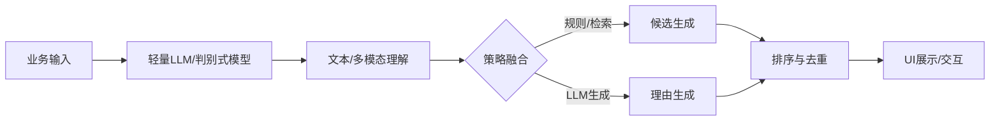
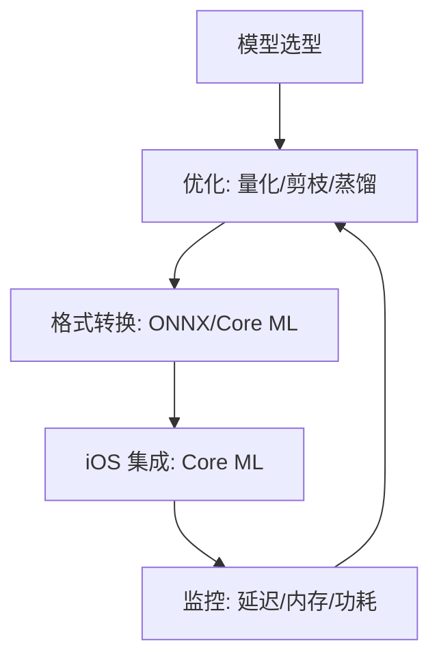

# 大规模语言模型移动端实践指南（总览与优化）

> 面向希望在移动端部署 LLM 的工程师与产品负责人，提供从模型选型、优化到转换与集成的可执行路径。包含必要流程图、命令与代码示例，可直接复用。

## 第一章：移动端 LLM 应用概述

### 与传统模型（BERT 等）的区别
- 能力范式：BERT 等判别式模型偏向理解与分类；LLM 偏向生成与多任务指令遵循。
- 计算特征：LLM 具有更长上下文、更多参数与注意力计算；在端侧需更强的优化组合（FP16/INT8、剪枝、蒸馏）。
- 应用差异：
  - BERT：文本分类、序列标注、语义匹配等轻量推理。
  - LLM：文本生成、对话、检索增强、跨模态理解与解释性推荐。
- 端侧权衡：在移动端，优先选择经裁剪与蒸馏的轻量 LLM（1B–3B），或判别式模型承担部分子任务，与 LLM 互补（Hybrid 架构）。

### 移动端应用场景分析
- 图像识别与理解：端侧图像分类、目标检测、OCR 与 VLM（视觉-语言）描述。
- 文本生成与分类：本地摘要、纠错、意图识别、指令式问答与离线问答。
- 个性化推荐：结合本地行为与商品语义，在端侧生成可解释推荐与理由。



## 第二章：模型裁剪与优化技术

> 目标：在不显著牺牲效果前提下，将模型体积与延迟控制到移动设备可用范围。每个技术节点包含前置条件、操作步骤、结果验证与常见问题。

### 2.1 量化压缩方法（Quantization）
- 前置条件：
  - Python ≥ 3.9，PyTorch ≥ 2.1，`coremltools` ≥ 7；有代表性校准样本（10k–100k）。
  - 建议执行：`proxy_on` 后再进行依赖安装。
- 操作步骤：
  - 安装与环境准备：
    ```bash
    proxy_on
    python -m venv .venv && source .venv/bin/activate
    pip install torch torchvision coremltools onnx onnxruntime
    ```
  - PyTorch 动态量化（线性层优先）：
    ```python
    import torch
    from torch.ao.quantization import quantize_dynamic

    model = ...  # 加载已训练的轻量LLM或判别式网络
    model.eval()

    qmodel = quantize_dynamic(model, {torch.nn.Linear}, dtype=torch.qint8)
    # 保存以便验证
    torch.save(qmodel.state_dict(), "model_int8.pt")
    ```
  - Core ML FP16 精度转换（移动端通用且稳定）：
    ```python
    import coremltools as ct
    import torch

    model = ...
    model.eval()
    example = torch.randn(1, 3, 224, 224)
    traced = torch.jit.trace(model, example)

    mlmodel = ct.convert(
        traced,
        inputs=[ct.TensorType(shape=example.shape)],
        compute_units=ct.ComputeUnit.ALL,
        compute_precision=ct.precision.FLOAT16,
    )
    mlmodel.save("Model_FP16.mlmodel")
    ```
- 预期结果验证：
  - 体积：FP16 通常减少约 50%；INT8 更小但转换兼容性受限。
  - 精度：对验证集评估 Top-1 / F1；偏差不超过业务阈值（如 ≤1–2%）。
  - 延迟：在目标设备上测量 p50/p90 推理时间，满足交互阈值（如 ≤100ms）。
- 常见问题与解决：
  - 问题：量化后的 Torch 模型直接转 Core ML 失败。
    - 解决：以浮点模型转换为 Core ML，再用 FP16；或走 ONNX 流程并约束算子集。
  - 问题：注意力模块量化后精度显著下降。
    - 解决：保持注意力权重为 FP16，仅量化 MLP/Linear；采用分层量化策略。

### 2.2 模型剪枝策略（Pruning）
- 前置条件：
  - 具备稠密权重模型，允许对卷积/线性层剪枝；有微调数据以恢复精度。
- 操作步骤：
  ```python
  import torch.nn.utils.prune as prune

  module = ...  # 如 nn.Linear/nn.Conv2d
  # 基于 L1 的非结构化剪枝，剪 30% 权重
  prune.l1_unstructured(module, name="weight", amount=0.3)
  # 固化剪枝掩码，导出稀疏权重
  prune.remove(module, "weight")
  ```
  - 对多个模块按重要性分配剪枝比例；完成后进行短周期微调（5–10 epoch）。
- 预期结果验证：
  - FLOPs 与参数量下降比例与目标一致（如 20–40%）。
  - 业务指标回归在可接受范围；微调后恢复曲线平稳。
- 常见问题与解决：
  - 问题：稀疏权重在 Core ML 端侧未获得速度收益。
    - 解决：优先结构化剪枝（通道/块级），利于硬件并行；或结合量化与蒸馏。

### 2.3 知识蒸馏实践（Distillation）
- 前置条件：
  - 有教师模型（中大型 LLM）与学生模型（1B–3B）；充足领域数据。
- 操作步骤（伪代码）：
  ```python
  teacher = ...  # 大模型，冻结推理
  student = ...  # 小模型，可训练
  optimizer = torch.optim.AdamW(student.parameters(), lr=5e-5)

  for batch in dataloader:
      with torch.no_grad():
          t_logits = teacher(batch.inputs)
      s_logits = student(batch.inputs)

      kl = torch.nn.functional.kl_div(
          torch.log_softmax(s_logits/2.0, dim=-1),
          torch.softmax(t_logits/2.0, dim=-1),
          reduction="batchmean",
      )
      loss = 0.5 * kl + 0.5 * task_loss(s_logits, batch.labels)
      loss.backward(); optimizer.step(); optimizer.zero_grad()
  ```
- 预期结果验证：
  - 学生模型在核心任务上接近教师水平，同时体积与延迟显著下降。
- 常见问题与解决：
  - 问题：学生泛化不足。
    - 解决：混合任务蒸馏（指令遵循 + 领域样本），并进行数据增强与温度调参。

## 2.4 端到端流程图（选型→优化→转换→集成→监控）



## 2.5 验证与迭代
- 设备实测：p50/p90 延迟、峰值内存、电量消耗；在关键路径采样埋点。
- 模型对比：优化前后 A/B 对照；异常回滚与灰度发布。
- 迭代策略：对失败样本回流训练，针对瓶颈模块再剪枝或替换为判别式子模型。

---

> 下一文档将针对 iOS 与 Core ML 提供完整集成与调优实操，包括 PyTorch/TensorFlow 到 CoreML 的转换案例、内存与计算优化、实时性测试指标与问题排查。