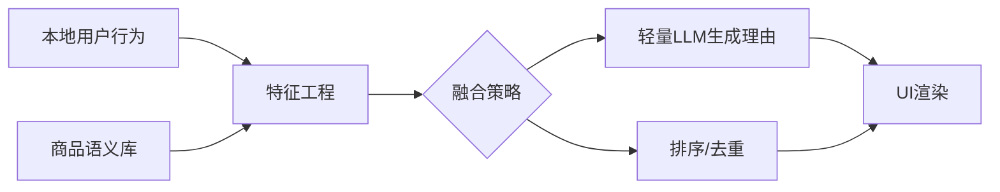

# 移动商城个性化推荐实战（端侧 LLM）

> 构建在用户设备本地运行的个性化推荐系统，强调隐私、安全与实时性。内容包含需求分析、数据处理、模型训练与部署、端侧推理与 A/B 测试方案。

## 第四章：移动商城个性化推荐实战

### 4.1 需求分析与方案设计
- 目标：在端侧结合用户行为与商品语义，生成 Top-N 推荐与可解释理由。
- 架构：轻量 LLM + 检索/规则融合；所有用户数据本地存储与计算。



### 4.2 数据处理流程
- 前置条件：本地数据库（Core Data/Realm），定义事件与商品 schema。
- 操作步骤：
  - 采集事件：浏览、搜索、加购、收藏、购买（含时间戳与上下文）。
  - 语义表示：对商品标题/描述做本地编码（轻量文本编码器或词袋）；或将候选商品文本直接提供给 LLM。
  - Prompt 生成：组合近期行为与候选商品，形成结构化提示。
- 预期结果验证：事件落库完整率≥99%，Prompt 字段无缺失；脏数据自动过滤。
- 常见问题与解决：
  - 数据膨胀：滚动窗口保留近 30–90 天数据；老数据聚合为统计特征。

### 4.3 模型选择与微调（可选）
- 选择：轻量 LLM（1B–3B），或判别式推荐模型（DNN/双塔）承担粗排，LLM 生成理由。
- 微调：在服务器侧进行通用领域微调与蒸馏，端侧部署学生模型。

### 4.4 端侧实时推理实现
- 前置条件：Core ML `.mlmodel` 已集成；定义输入输出协议（JSON）。
- 操作步骤：
  - Prompt 模板示例：
    ```text
    作为电商推荐专家，请根据以下用户信息和候选商品，推荐 3 个最相关商品，并以 JSON 返回 {id, reason}。

    # 用户信息
    - 最近搜索: "男士跑鞋"、"防水冲锋衣"
    - 最近浏览: "品牌A轻便跑鞋"、"品牌B户外夹克"
    - 收藏夹: "品牌C登山杖"

    # 候选商品
    1. [101] 品牌D越野跑鞋
    2. [102] 品牌E商务衬衫
    3. [103] 品牌A通勤双肩包
    4. [104] 品牌B三合一冲锋衣
    ```
  - Swift 侧推理与解析：
    ```swift
    import CoreML
    import Foundation

    let config = MLModelConfiguration(); config.computeUnits = .all
    let model = try RecommenderLLM(configuration: config)

    let prompt = ... // 由端侧拼接生成
    let input = RecommenderLLMInput(prompt: prompt)

    let start = CACurrentMediaTime()
    let output = try model.prediction(input: input)
    let latency = CACurrentMediaTime() - start

    let json = output.resultJSON.data(using: .utf8)!
    let items = try JSONDecoder().decode([RecItem].self, from: json)
    // struct RecItem: Decodable { let id: Int; let reason: String }
    ```
- 预期结果验证：推荐理由语义合理；Top-N 点击率提升；端侧延迟满足阈值。
- 常见问题与解决：
  - 生成结果不稳定：加入系统指令、候选约束与格式检查；遇到解析失败进行回退策略。

### 4.5 A/B 测试方案
- 分流：按用户/设备维度固定随机分组（A：基线；B：LLM 推荐）。
- 指标：CTR、CVR、GMV、留存；技术指标含 p50/p90 延迟与崩溃率。
- 实施：
  - 埋点：事件统一打点（曝光/点击/加购/购买）；携带分组标记与版本号。
  - 统计：按天/周出报表，显著性检验（双侧 t 检验或非参检验）。
  - 回滚：若负向超阈值，自动降级为基线策略（规则/粗排）。

### 4.6 隐私保护策略
- 本地存储：敏感事件仅端侧保存，脱敏聚合用于统计；开启设备级加密。
- 权限与透明：明确隐私政策，允许用户关闭或清空数据。
- 传输控制：如需云端协作，仅上传匿名统计或加密摘要（不含原始行为）。

### 4.7 性能监控方案
- 指标：延迟、内存、功耗、错误率；异常帧率下降告警。
- 实施：统一日志与监控 SDK，关键路径打点；阈值触发降级（缩短上下文）。