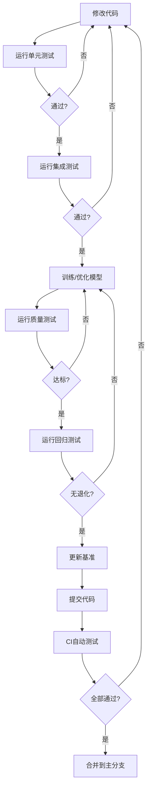

# 模型质量测试完整指南

## 📖 概述

本文档详细说明了MorningGoalModel项目的模型质量测试体系，包括测试框架、自动化流程和最佳实践。

## 🎯 测试目标

1. **确保模型质量**: 验证模型性能达到预设标准
2. **防止性能退化**: 确保新模型不比基线模型差
3. **自动化验证**: 通过CI/CD自动运行测试
4. **持续改进**: 建立性能基准并跟踪改进

## 🏗️ 测试架构

### 测试金字塔

```
           /\
          /  \
         / 回归 \      - 对比基准模型
        /--------\
       /  质量   \     - 验证性能指标
      /----------\
     /   集成    \    - 测试推理pipeline
    /------------\
   /    单元      \   - 测试模型组件
  /----------------\
```

### 测试层级说明

| 层级 | 文件 | 测试内容 | 运行时间 | 依赖 |
|------|------|----------|----------|------|
| **单元测试** | `test_model_unit.py` | 模型架构、组件功能 | 快 (~30s) | 无 |
| **集成测试** | `test_model_integration.py` | 完整推理流程 | 中 (~2min) | 训练好的模型 |
| **质量测试** | `test_model_quality.py` | 性能指标达标 | 慢 (~5min) | 模型 + 测试数据 |
| **回归测试** | `test_model_regression.py` | 对比基准性能 | 慢 (~5min) | 模型 + 基准数据 |

## 📋 测试清单

### ✅ 单元测试检查项

- [ ] 模型能正确初始化
- [ ] 前向传播输出形状正确
- [ ] 损失计算正常
- [ ] 梯度能正常反向传播
- [ ] 输出概率分布合理（和为1，范围[0,1]）
- [ ] 模型能正确保存和加载

### ✅ 集成测试检查项

- [ ] 预测器正常初始化
- [ ] 单样本预测功能正常
- [ ] 批量预测功能正常
- [ ] 预测结果一致（相同输入→相同输出）
- [ ] 能处理边界情况（空文本、长文本、特殊字符）
- [ ] 推理速度满足要求
- [ ] 内存使用合理（不会OOM）

### ✅ 质量测试检查项

- [ ] 主题分类准确率 ≥ 60%
- [ ] 主题分类Macro F1 ≥ 55%
- [ ] 情感分析准确率 ≥ 70%
- [ ] 情感分析Macro F1 ≥ 65%
- [ ] 置信度分布合理
- [ ] 预测标签分布均衡

### ✅ 回归测试检查项

- [ ] 主题准确率下降 < 5%
- [ ] 主题F1下降 < 5%
- [ ] 情感准确率下降 < 5%
- [ ] 情感F1下降 < 5%

## 🚀 使用方法

### 本地运行测试

#### 方法1: 使用便捷脚本（推荐）

```bash
# 运行所有测试
bash scripts/run_tests.sh

# 运行特定级别的测试
bash scripts/run_tests.sh -t unit          # 单元测试
bash scripts/run_tests.sh -t integration   # 集成测试
bash scripts/run_tests.sh -t quality       # 质量测试
bash scripts/run_tests.sh -t regression    # 回归测试

# 指定测试样本数
bash scripts/run_tests.sh -t quality -s 1000

# 测试特定模型
bash scripts/run_tests.sh -m models/trained/new_model

# 详细输出
bash scripts/run_tests.sh -v
```

#### 方法2: 直接使用pytest

```bash
# 运行所有测试
pytest tests/ -v

# 运行特定文件
pytest tests/test_model_unit.py -v

# 使用标记运行
pytest -m unit -v              # 只运行单元测试
pytest -m "not slow" -v        # 跳过慢速测试

# 并行运行（需要安装pytest-xdist）
pytest tests/ -n auto

# 生成HTML报告
pytest tests/ --html=test_report.html --self-contained-html

# 显示覆盖率
pytest tests/ --cov=src --cov-report=html
```

### GitHub Actions 自动化测试

#### 配置1: 代码推送时自动测试

当你推送代码到 `main` 或 `develop` 分支时，GitHub Actions会自动：

1. 运行所有测试
2. 生成测试报告
3. 计算代码覆盖率
4. 在PR中评论结果

**工作流文件**: `.github/workflows/model_quality_test.yml`

#### 配置2: 模型训练后自动测试

训练新模型后，可以手动触发测试工作流：

1. 进入GitHub仓库的 **Actions** 页面
2. 选择 **Model Training & Quality Check**
3. 点击 **Run workflow**
4. 输入参数并运行

**工作流文件**: `.github/workflows/model_training_test.yml`

## ⚙️ 配置管理

### 测试配置文件结构

**文件**: `tests/test_config.json`

```json
{
  "model_path": "models/trained/distill_student",
  "quality_thresholds": {
    "topic_accuracy_min": 0.60,
    "topic_f1_min": 0.55,
    "sentiment_accuracy_min": 0.70,
    "sentiment_f1_min": 0.65,
    "inference_time_max_ms": 100
  },
  "regression_thresholds": {
    "max_accuracy_drop": 0.05,
    "max_f1_drop": 0.05
  },
  "test_settings": {
    "max_test_samples": 500,
    "regression_test_samples": 300,
    "random_seed": 42
  }
}
```

### 修改质量阈值

根据实际需求调整阈值：

```bash
# 编辑配置文件
vim tests/test_config.json

# 修改相应的阈值
# 例如：提高主题分类要求到65%
"topic_accuracy_min": 0.65
```

### 更新基准模型

当训练出更好的模型时，更新基准：

```bash
# 1. 运行质量测试，生成当前模型指标
bash scripts/run_tests.sh -t quality

# 2. 检查当前指标
cat tests/reports/current_metrics.json

# 3. 如果满意，更新基准
python scripts/update_baseline.py \
    --model-version "v2.1" \
    --current-metrics tests/reports/current_metrics.json \
    --baseline tests/baseline_metrics.json

# 4. 验证回归测试通过
bash scripts/run_tests.sh -t regression
```

### 环境变量

可以通过环境变量临时覆盖配置：

```bash
# 限制测试样本数（加快测试）
TEST_MAX_SAMPLES=100 pytest tests/test_model_quality.py

# 回归测试样本数
REGRESSION_TEST_SAMPLES=200 pytest tests/test_model_regression.py
```

## 📊 测试报告

### 报告类型

测试运行后会生成多种报告：

1. **HTML测试报告** (`test_reports/*.html`)
   - 每个测试的详细结果
   - 失败测试的完整日志
   - 测试执行时间统计

2. **JSON性能报告** (`tests/reports/*.json`)
   - 详细的性能指标
   - 分类报告（precision, recall, F1）
   - 可用于程序化分析

3. **覆盖率报告** (`htmlcov/index.html`)
   - 代码测试覆盖率
   - 未覆盖的代码行
   - 覆盖率趋势

### 查看报告

```bash
# 在浏览器中打开HTML报告
open test_reports/all_tests_report.html

# 查看覆盖率报告
open htmlcov/index.html

# 查看JSON性能指标
cat tests/reports/current_metrics.json | python -m json.tool
```

### 解读测试结果

#### 示例：成功的测试输出

```
tests/test_model_quality.py::TestModelQuality::test_topic_accuracy PASSED
主题分类准确率: 0.6523 (最低要求: 0.6000)

tests/test_model_quality.py::TestModelQuality::test_sentiment_accuracy PASSED
情感分析准确率: 0.7621 (最低要求: 0.7000)
```

#### 示例：失败的测试输出

```
tests/test_model_quality.py::TestModelQuality::test_topic_accuracy FAILED
主题分类准确率: 0.5823 (最低要求: 0.6000)
AssertionError: 主题分类准确率 0.5823 低于阈值 0.6000
```

**处理失败**:
1. 检查模型训练是否充分
2. 分析错误预测的样本
3. 考虑调整模型架构或训练策略
4. 如果是数据问题，清洗数据集
5. 如果阈值不合理，可以调整配置

## 🔄 开发工作流

### 标准开发流程



### 快速迭代流程

在开发过程中快速验证：

```bash
# 1. 修改代码后，快速运行单元测试
pytest tests/test_model_unit.py -x  # -x: 遇到第一个失败就停止

# 2. 单元测试通过后，运行完整测试
bash scripts/run_tests.sh -t all

# 3. 如果要跳过慢速测试
pytest tests/ -m "not slow" -v
```

### 模型迭代流程

训练新模型后的完整验证：

```bash
# 1. 训练模型
python src/training/train_multitask.py --output_dir models/trained/new_model

# 2. 更新测试配置指向新模型
# 编辑 tests/test_config.json, 修改 model_path

# 3. 运行质量测试
bash scripts/run_tests.sh -t quality -s 1000

# 4. 如果通过，运行回归测试
bash scripts/run_tests.sh -t regression

# 5. 如果新模型更好，更新基准
python scripts/update_baseline.py --model-version "v2.1"

# 6. 提交更改
git add models/trained/new_model tests/baseline_metrics.json
git commit -m "feat: update model v2.1 with improved performance"
```

## 🐛 故障排查

### 常见问题

#### 1. 模型文件未找到

**错误**: `Model not found at models/trained/distill_student`

**解决**:
```bash
# 检查模型文件是否存在
ls -la models/trained/distill_student

# 如果不存在，训练模型或下载预训练模型
# 或者修改 tests/test_config.json 中的路径
```

#### 2. 测试数据未找到

**错误**: `Test data not found at data/processed/test_multitask.csv`

**解决**:
```bash
# 检查测试数据
ls -la data/processed/test_multitask.csv

# 如果不存在，生成测试数据
python src/data/prepare_dataset.py
```

#### 3. CUDA内存不足

**错误**: `RuntimeError: CUDA out of memory`

**解决**:
```bash
# 方案1: 减少测试样本数
TEST_MAX_SAMPLES=100 pytest tests/test_model_quality.py

# 方案2: 使用CPU模式
# 在 conftest.py 中设置 use_gpu=False

# 方案3: 减小batch size
# 修改测试代码中的batch_size参数
```

#### 4. 测试运行时间过长

**解决**:
```bash
# 并行运行测试（需要安装pytest-xdist）
pip install pytest-xdist
pytest tests/ -n auto

# 只运行快速测试
pytest -m "not slow"

# 减少测试样本
TEST_MAX_SAMPLES=200 pytest tests/
```

#### 5. 质量测试不通过

**分析步骤**:

1. 查看详细报告
```bash
cat tests/reports/quality_test_report.json | python -m json.tool
```

2. 分析混淆矩阵，找出问题类别

3. 检查错误预测样本
```python
# 在Jupyter notebook中
import pandas as pd
df = pd.read_csv('data/processed/test_multitask.csv')
# 分析错误预测
```

4. 决定是模型问题还是阈值问题

## 📈 性能监控

### 建立性能基准

初次设置时：

```bash
# 1. 用当前最好的模型运行测试
bash scripts/run_tests.sh -t quality

# 2. 设置为基准
python scripts/update_baseline.py --model-version "baseline_v1.0"
```

### 跟踪性能变化

每次重要更新后：

```bash
# 运行测试并保存结果
bash scripts/run_tests.sh > test_log_$(date +%Y%m%d).txt

# 对比历史性能
python -c "
import json
with open('tests/baseline_metrics.json') as f:
    baseline = json.load(f)
with open('tests/reports/current_metrics.json') as f:
    current = json.load(f)

for key in ['topic_accuracy', 'sentiment_accuracy']:
    diff = current[key] - baseline[key]
    print(f'{key}: {baseline[key]:.4f} -> {current[key]:.4f} ({diff:+.4f})')
"
```

## 🔐 最佳实践

### 1. 测试驱动开发

- ✅ 修改代码前先运行测试，确保基线正常
- ✅ 修改代码后立即运行相关测试
- ✅ 提交前运行完整测试套件

### 2. 持续集成

- ✅ 每次Push都触发CI测试
- ✅ PR必须通过所有测试才能合并
- ✅ 定期运行完整的质量测试（每周/每次release）

### 3. 性能基准管理

- ✅ 只在验证性能确实提升后才更新基准
- ✅ 更新基准时记录详细的变更说明
- ✅ 保留基准文件的历史版本（通过Git）

### 4. 测试数据管理

- ✅ 使用固定的随机种子确保可重复性
- ✅ 定期更新测试数据集反映真实数据分布
- ✅ 对测试数据进行版本控制

### 5. 报告和文档

- ✅ 保存测试报告作为模型发布文档的一部分
- ✅ 在PR描述中包含测试结果摘要
- ✅ 重大性能变化要详细记录原因

## 📚 扩展阅读

- [Pytest官方文档](https://docs.pytest.org/)
- [模型评估最佳实践](https://ml-ops.org/content/mlops-principles)
- [持续集成最佳实践](https://www.thoughtworks.com/continuous-integration)

## 🤝 贡献

改进测试框架的建议：

1. Fork项目并创建特性分支
2. 添加新的测试或改进现有测试
3. 确保所有测试通过
4. 提交PR并描述改进内容

## 📞 获取帮助

如有问题，请：

1. 查看 [tests/README.md](../../tests/README.md)
2. 查看故障排查部分
3. 提交Issue描述问题

---

**最后更新**: 2024-12-30
**版本**: 1.0
**维护者**: MorningGoalModel Team

