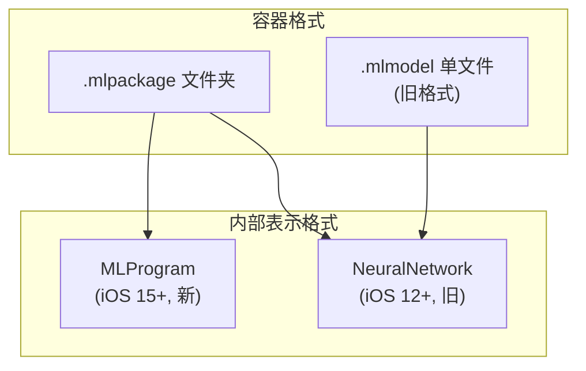
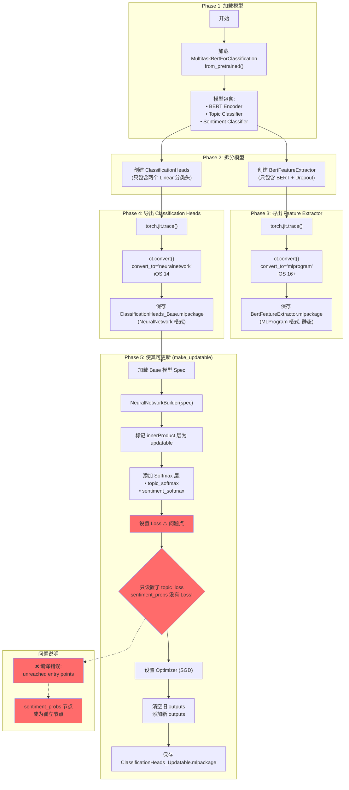
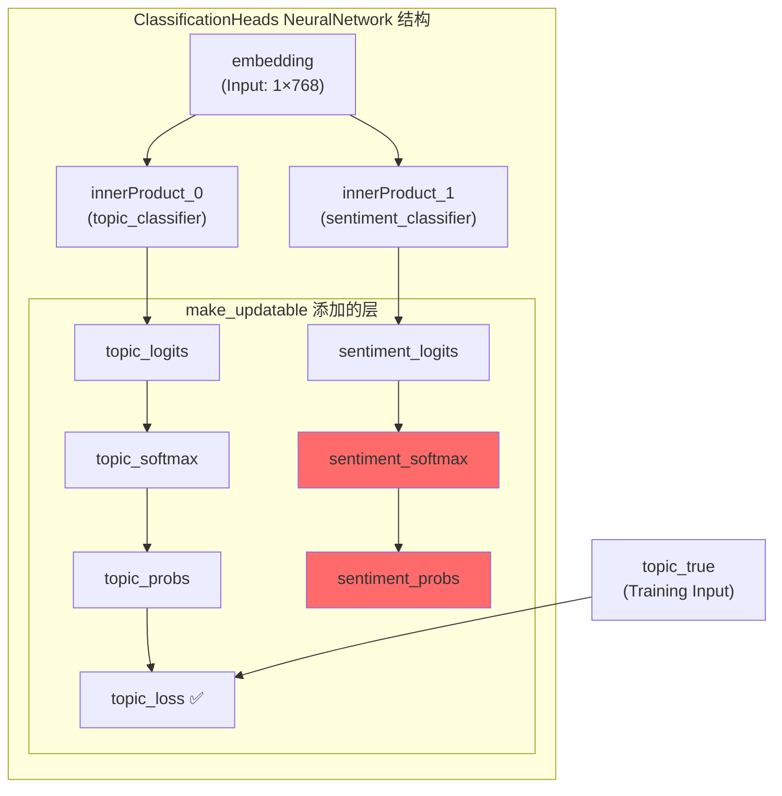
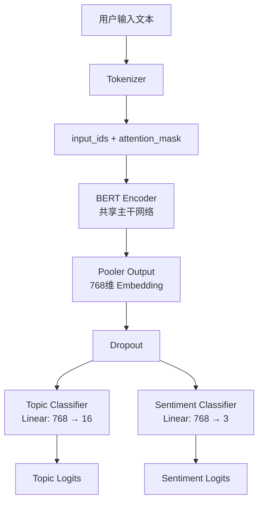
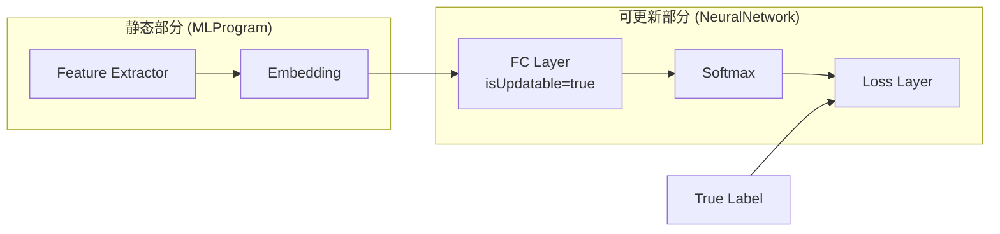
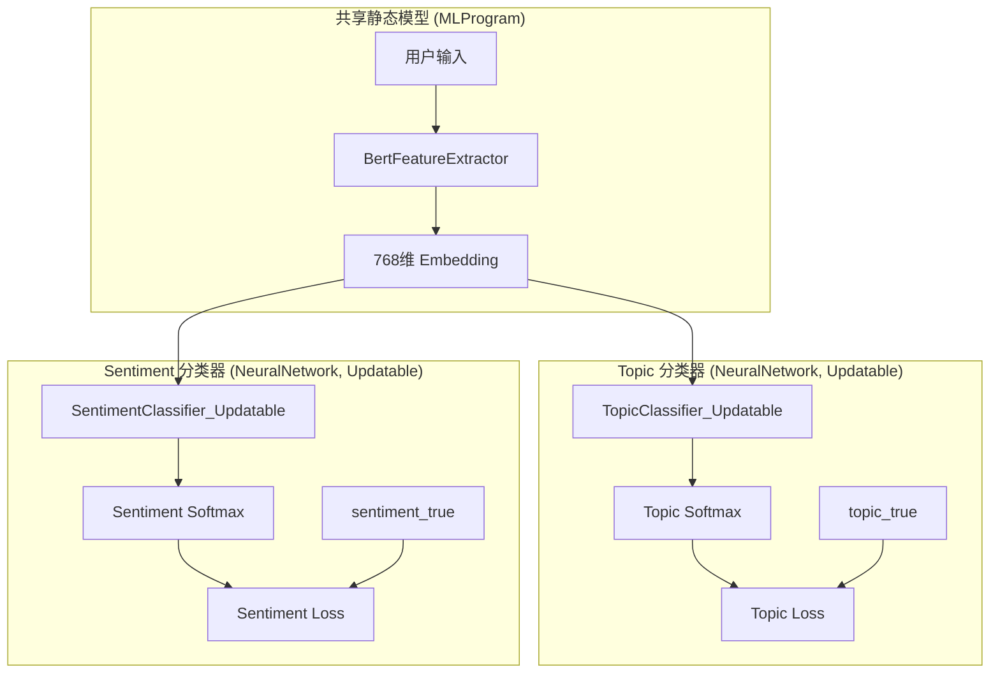
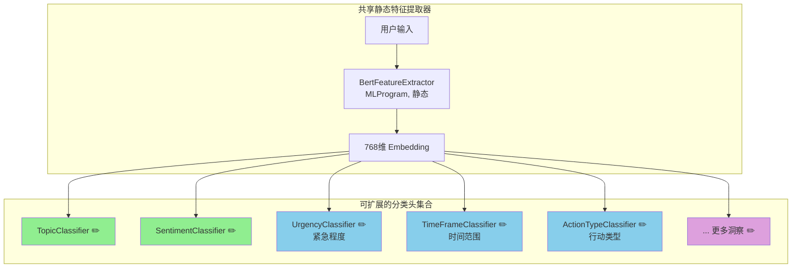
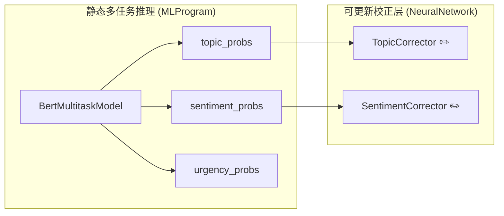

# CoreML Updatable Model 架构分析报告

## 目录
1. [MLProgram vs NeuralNetwork 格式详解](#1-mlprogram-vs-neuralnetwork-格式详解)
2. [当前导出脚本流程图](#2-当前导出脚本流程图)
3. [当前模型架构分析](#3-当前模型架构分析)
4. [CoreML Updatable Model 要求](#4-coreml-updatable-model-要求)
5. [架构兼容性评估](#5-架构兼容性评估)
6. [双模型方案可行性分析](#6-双模型方案可行性分析)
7. [推荐方案](#7-推荐方案)

---

## 1. MLProgram vs NeuralNetwork 格式详解

### 1.1 两种格式都可以导出为 `.mlpackage`

> [!IMPORTANT]
> **是的，两种格式都可以导出为 `.mlpackage`！** `.mlpackage` 是一种 **容器格式**，可以包含 MLProgram 或 NeuralNetwork。

| 问题 | 答案 |
|-----|------|
| MLProgram 能导出为 .mlpackage? | ✅ 是的 |
| NeuralNetwork 能导出为 .mlpackage? | ✅ 是的 |
| MLProgram 是 Apple 特有的? | ✅ 是的，Apple CoreML 专属 |

### 1.2 格式对比



### 1.3 详细对比表

| 特性 | MLProgram | NeuralNetwork |
|-----|-----------|---------------|
| **引入版本** | iOS 15 / macOS 12 | iOS 12 / macOS 10.14 |
| **文件扩展名** | `.mlpackage` | `.mlmodel` 或 `.mlpackage` |
| **内部结构** | 程序化表示 (类似 IR) | 计算图 (Layers 列表) |
| **权重存储** | 独立的 weights 目录 | 嵌入在 spec 中 |
| **精度控制** | Float16/Float32 可精细控制 | 有限控制 |
| **性能** | 更优 (Neural Engine 优化) | 较好 |
| **端侧更新** | ❌ **不支持** | ✅ **支持** |
| **推荐用途** | 静态推理模型 | 需要端侧训练的模型 |

### 1.4 coremltools 转换参数

```python
import coremltools as ct

# 导出为 MLProgram (.mlpackage)
ct.convert(model, convert_to="mlprogram", ...)  # iOS 15+

# 导出为 NeuralNetwork (.mlmodel 或 .mlpackage 都可以)
ct.convert(model, convert_to="neuralnetwork", ...)  # iOS 12+
```

> [!NOTE]
> **关键点**: 虽然两种格式都可以保存为 `.mlpackage`，但 **只有 NeuralNetwork 格式支持端侧更新**。

---

## 2. 当前导出脚本流程图

### 2.1 export_split_model_coreml.py 完整流程



### 2.2 make_updatable 函数详细流程

```mermaid
flowchart LR
    subgraph "输入"
        A["ClassificationHeads_Base.mlpackage"]
    end
    
    subgraph "处理步骤"
        B["1. 加载 MLModel"] --> C["2. 获取 NeuralNetwork Spec"]
        C --> D["3. 遍历所有层<br/>找到 innerProduct 层"]
        D --> E["4. builder.make_updatable()<br/>标记为可更新"]
        E --> F["5. add_softmax()<br/>为两个输出添加 softmax"]
        F --> G["6. set_categorical_cross_entropy_loss()<br/>⚠️ 只设置了 topic!"]
        G --> H["7. set_sgd_optimizer()"]
        H --> I["8. set_epochs(10)"]
        I --> J["9. 更新 spec.description.output"]
    end
    
    subgraph "输出"
        K["ClassificationHeads_Updatable.mlpackage"]
    end
    
    A --> B
    J --> K
    
    style G fill:#ff6b6b
```



### 2.3 当前脚本的层结构



> [!CAUTION]
> **问题可视化**: `sentiment_probs` 节点 (红色) 没有连接到任何 Loss 层，成为 **"unreached entry point"**

---

## 3. 当前模型架构分析

### 3.1 MultitaskBertForClassification 架构



### 3.2 关键特征

| 特征 | 当前模型 | Updatable 要求 |
|-----|---------|---------------|
| 可更新层类型 | Linear (Fully-Connected) ✅ | 仅支持 Conv 和 FC |
| Loss 数量 | 2 个 (topic + sentiment) ❌ | 仅支持 1 个 |
| 输出头数量 | 2 个 ❌ | 1 个 Loss 对应 1 个目标 |
| 模型格式 | 需 NeuralNetwork | ✅ 可转换 |

---

## 4. CoreML Updatable Model 要求

### 4.1 核心技术限制

> [!CAUTION]
> **关键限制**: CoreML Updatable 模型 **不支持多个 Loss 层**

| 要求 | 说明 |
|-----|------|
| `isUpdatable = true` | 模型级别标记 |
| 可更新层类型 | 仅 **Convolutional** 和 **Fully-Connected (innerProduct)** |
| Loss 层数量 | **仅支持 1 个** |
| 支持的 Loss 类型 | `categoricalCrossEntropy`, `meanSquaredError` |
| Optimizer | SGD 或 Adam |
| 模型格式 | **必须是 `NeuralNetwork`**, `MLProgram` 不支持更新 |

### 4.2 典型 Updatable 模型架构



---

## 5. 架构兼容性评估

### 5.1 源头架构问题

> [!IMPORTANT]
> **结论: 当前多任务架构从设计上就不适合 CoreML Updatable 模型**

| 问题点 | 分析 |
|-------|-----|
| **双输出头** | 需要两个独立的 Loss 来分别监督 topic 和 sentiment |
| **无法合并 Loss** | topic (16类) 和 sentiment (3类) 是完全不同的分类任务，语义上无法合并 |
| **NeuralNetworkBuilder 限制** | 即使手动添加两个 softmax，只能 `set_categorical_cross_entropy_loss` 一次 |

### 5.2 当前导出脚本的问题

查看 [export_split_model_coreml.py](file:///Users/apple/Developments/BertTest/colab_distillation_kit/src/export/export_split_model_coreml.py#L108-L112):

```python
# 只设置了 topic_loss，sentiment 没有 Loss
builder.set_categorical_cross_entropy_loss(
    name="topic_loss",
    input="topic_probs"
)
# ❌ 没有 sentiment_loss - 这导致 sentiment_probs 成为孤立节点
```

这就是 **"unreached entry points"** 错误的直接原因。

---

## 6. 双模型方案可行性分析

### 6.1 架构设计



### 6.2 一次输入更新两个模型: **可行** ✅

在 iOS 端可以实现:

```swift
// 1. 提取一次 Embedding (共享)
let embedding = try featureExtractor.prediction(input: bertInput).embedding

// 2. 创建两个 BatchProvider，使用相同的 Embedding
let topicBatch = MLArrayBatchProvider(dictionary: [
    "embedding": [embedding],
    "topic_true": [correctedTopic]
])

let sentimentBatch = MLArrayBatchProvider(dictionary: [
    "embedding": [embedding],
    "sentiment_true": [correctedSentiment]
])

// 3. 并行或串行更新两个模型
let topicUpdateTask = try MLUpdateTask(
    forModelAt: topicModelURL,
    trainingData: topicBatch,
    configuration: nil
) { context in
    try context.model.write(to: updatedTopicModelURL)
}

let sentimentUpdateTask = try MLUpdateTask(
    forModelAt: sentimentModelURL,
    trainingData: sentimentBatch,
    configuration: nil
) { context in
    try context.model.write(to: updatedSentimentModelURL)
}

// 同时启动两个更新任务
topicUpdateTask.resume()
sentimentUpdateTask.resume()
```

### 6.3 双模型方案优缺点

| 优点 | 缺点 |
|-----|-----|
| ✅ 两个任务都可独立端侧更新 | ⚠️ 需要维护 3 个模型文件 |
| ✅ Embedding 只需计算一次 | ⚠️ 两个 MLUpdateTask 的同步管理 |
| ✅ 架构清晰，完全符合 CoreML 要求 | ⚠️ App 体积略增 (但 Classifier 很小) |
| ✅ 灵活性高，可独立更新某一项 | |

---

## 7. 推荐方案

### 方案对比

| 方案 | 复杂度 | 端侧更新能力 | 推荐指数 |
|-----|-------|-------------|---------|
| **A: 单任务更新** | 低 | 只能更新 Topic 或 Sentiment 之一 | ⭐⭐⭐ |
| **B: 双独立模型** | 中 | ✅ 两个任务都可更新 | ⭐⭐⭐⭐⭐ |
| **C: 放弃端侧更新** | 低 | ❌ 无 | ⭐⭐ |

### 推荐: 方案 B - 双独立可更新模型

> [!TIP]
> **最佳实践**: 将模型拆分为 **1 个静态特征提取器 + 2 个可更新分类头**

**最终模型文件结构**:
```
models/
├── BertFeatureExtractor.mlpackage      # MLProgram, 静态, ~50MB
├── TopicClassifier_Updatable.mlmodel   # NeuralNetwork, Updatable, ~50KB
└── SentimentClassifier_Updatable.mlmodel # NeuralNetwork, Updatable, ~10KB
```

**需要修改的代码**:
1. [export_split_model_coreml.py](file:///Users/apple/Developments/BertTest/colab_distillation_kit/src/export/export_split_model_coreml.py) - 导出两个独立的 Classifier
2. iOS 端 Swift 代码 - 加载和更新两个模型

---

## 8. 可扩展性分析：未来新增洞察维度

### 8.1 核心问题：每新增一个洞察维度，是否需要新增一个独立模型？

> [!IMPORTANT]
> **简短回答**: 如果需要端侧更新，**是的**，每个分类任务需要一个独立的 Updatable 模型。

### 8.2 "扇出"架构 (Fan-out Architecture)



**图例**: 
- 🟢 绿色 = 当前已实现
- 🔵 蓝色 = 可能的扩展
- 🟣 紫色 = 未来更多扩展

### 8.3 可能的未来洞察维度示例

| 洞察维度 | 类别数 | 用途 | Classifier 大小 |
|---------|-------|------|----------------|
| **Topic** (主题) | 16 | 用户目标的主题分类 | ~50KB |
| **Sentiment** (情感) | 3 | 积极/中性/消极 | ~10KB |
| **Urgency** (紧急度) | 3 | 高/中/低 | ~10KB |
| **TimeFrame** (时间范围) | 4 | 今天/本周/本月/长期 | ~15KB |
| **ActionType** (行动类型) | 5 | 学习/运动/工作/生活/社交 | ~20KB |
| **Difficulty** (难度) | 3 | 简单/中等/困难 | ~10KB |

### 8.4 扇出架构的优缺点

| 优点 | 缺点 |
|-----|-----|
| ✅ 每个维度独立更新，互不影响 | ⚠️ 模型文件数量增加 |
| ✅ 可按需加载（懒加载） | ⚠️ iOS 代码管理复杂度增加 |
| ✅ 用户只纠正某一维度时，只更新对应模型 | ⚠️ 需要统一的 ModelManager 管理 |
| ✅ Embedding 只计算一次，分类头极快 (~1ms) | |
| ✅ 新增维度只需训练新分类头，不影响已有模型 | |

### 8.5 替代方案评估

#### 方案 A: n 个独立 Updatable 模型 (推荐)

```
BertFeatureExtractor.mlpackage (50MB, 静态)
├── TopicClassifier.mlmodel (50KB, Updatable)
├── SentimentClassifier.mlmodel (10KB, Updatable)
├── UrgencyClassifier.mlmodel (10KB, Updatable)
└── ... 更多
```

**推荐理由**:
- 架构清晰，符合 CoreML 要求
- 每个分类头极小 (10-50KB)
- 总增量 = n × ~20KB，完全可接受

---

#### 方案 B: 放弃端侧更新，使用静态多任务模型

```
BertMultitaskModel.mlpackage (50MB, 静态 MLProgram)
├── 输出: topic_probs
├── 输出: sentiment_probs
├── 输出: urgency_probs
└── 输出: ... 更多
```

**特点**:
- ✅ 单一模型，管理简单
- ✅ MLProgram 性能更优
- ❌ **无法端侧更新**，需要 OTA 推送新模型

---

#### 方案 C: 混合架构 (高级)



**特点**:
- 主推理用高性能 MLProgram
- 只对需要个性化的维度添加"校正层"
- 校正层学习用户偏好的偏移量
- 更复杂，需要仔细设计

### 8.6 针对您场景的建议

> [!TIP]
> **针对 "Morning Goal" 应用的推荐**

考虑到您的场景（日记/目标输入分析），我建议：

1. **现阶段**: 采用 **方案 A (扇出架构)**
   - 1 个静态 Feature Extractor + n 个 Updatable Classifier
   - 每个洞察维度一个独立的可更新模型

2. **iOS 端设计**:
   ```swift
   class InsightModelManager {
       let featureExtractor: BertFeatureExtractor  // 共享，只加载一次
       
       var classifiers: [String: UpdatableClassifier] = [
           "topic": topicClassifier,
           "sentiment": sentimentClassifier,
           // 未来扩展...
       ]
       
       func analyze(text: String) -> [String: Any] {
           let embedding = featureExtractor.extract(text)
           return classifiers.mapValues { $0.predict(embedding) }
       }
       
       func update(dimension: String, embedding: MLMultiArray, label: String) {
           classifiers[dimension]?.update(embedding: embedding, label: label)
       }
   }
   ```

3. **扩展新维度时**:
   - 训练新的分类头 (Python 端)
   - 导出为 Updatable NeuralNetwork
   - iOS 端添加到 `classifiers` 字典
   - **无需修改 Feature Extractor**

### 8.7 总结

| 未来扩展问题 | 答案 |
|------------|------|
| 新增维度是否需要新模型？ | **是的**，需要一个新的 Updatable Classifier |
| 这会造成问题吗？ | **不会**，分类头极小 (~10-50KB)，且共享 Embedding |
| 有没有单模型解决方案？ | 有，但需要放弃端侧更新能力 |
| 推荐方案？ | 扇出架构 (1 静态 + n 可更新) |

---

## 总结

| 问题 | 答案 |
|-----|-----|
| 当前架构从源头就不适合 Updatable? | **是的**，多任务双 Loss 设计与 CoreML 单 Loss 限制根本冲突 |
| Updatable 模型一般架构要求? | 单输出、单 Loss、仅 Conv/FC 可更新、必须用 NeuralNetwork 格式 |
| 双模型能一次输入更新? | **可以**，共享 Embedding，分别调用两个 MLUpdateTask |
| 未来扩展新洞察维度? | 每个维度需要一个独立的 Updatable Classifier，但这符合最佳实践 |
