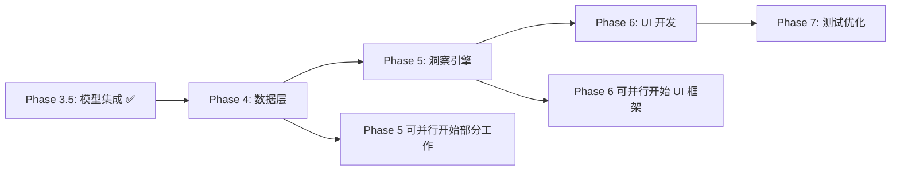

# 用户数据洞察系统 - 实施计划

> 基于 `User_Insight_System_Design.md` 设计文档
> 更新时间: 2026-01-24

---

## 总体架构

```
┌─────────────────────────────────────────────────────────────────┐
│                        用户输入文本                              │
└──────────────────────────┬──────────────────────────────────────┘
                           │
                           ▼
┌─────────────────────────────────────────────────────────────────┐
│              BertFeatureExtractor.mlpackage (静态)               │
│                       → 768维 Embedding                         │
└──────────────────────────┬──────────────────────────────────────┘
                           │
    ┌────────┬────────┬────┴────┬────────┬────────┬────────┐
    ▼        ▼        ▼         ▼        ▼        ▼        ▼
┌───────┐┌───────┐┌───────┐┌───────┐┌───────┐┌───────┐┌───────┐
│Topic  ││Senti- ││Urgency││Time-  ││Action-││Diffi- ││Speci- │
│(16cls)││ment   ││(3cls) ││Frame  ││Type   ││culty  ││ficity │
│  ✅   ││(3cls) ││  ✅   ││(4cls) ││(5cls) ││(3cls) ││(3cls) │
│       ││  ✅   ││       ││  ✅   ││  ✅   ││  ✅   ││  ✅   │
└───┬───┘└───┬───┘└───┬───┘└───┬───┘└───┬───┘└───┬───┘└───┬───┘
    │        │        │        │        │        │        │
    └────────┴────────┴────┬───┴────────┴────────┴────────┘
                           │
                           ▼
┌─────────────────────────────────────────────────────────────────┐
│                    GoalDataAggregator (待实现)                   │
│                   (Core Data / SQLite)                          │
└──────────────────────────┬──────────────────────────────────────┘
                           │
    ┌──────────────────────┼──────────────────────┐
    ▼                      ▼                      ▼
┌───────────┐       ┌───────────┐          ┌───────────┐
│Pattern    │       │Balance    │          │Trend      │
│Analyzer   │       │Advisor    │          │Analyzer   │
│ (待实现)  │       │ (待实现)  │          │ (待实现)  │
└─────┬─────┘       └─────┬─────┘          └─────┬─────┘
      │                   │                      │
      └───────────────────┼──────────────────────┘
                          ▼
┌─────────────────────────────────────────────────────────────────┐
│                    InsightGenerator (待实现)                     │
│                  (规则引擎 + 模板系统)                           │
└──────────────────────────┬──────────────────────────────────────┘
                           │
                           ▼
┌─────────────────────────────────────────────────────────────────┐
│                   InsightDashboardView (待实现)                  │
│               (洞察卡片 + 趋势图表 + 统计)                       │
└─────────────────────────────────────────────────────────────────┘
```

**图例**: ✅ 已完成

---

## 当前进度

### 已完成 ✅

| 阶段 | 内容 | 状态 |
|------|------|------|
| Phase 1 | 数据准备 & 标注 | ✅ 完成 |
| Phase 2 | 训练 7 个分类器 | ✅ 完成 |
| Phase 3 | CoreML 导出 | ✅ 完成 |
| Phase 3.5 | iOS 模型集成 & 调试界面 | ✅ 完成 |
| Phase 4.1-4.2 | Core Data 模型扩展 & AnalysisResult | ✅ 完成 |

### 待开始 ⏳

| 阶段 | 内容 | 优先级 |
|------|------|--------|
| Phase 4.3 | GoalDataAggregator 聚合服务 | P0 |
| Phase 5 | 洞察引擎 | P0 |
| Phase 6 | UI 开发 | P1 |
| Phase 7 | 测试 & 优化 | P1 |

---

## Phase 3.5: iOS 模型集成 (已完成) ✅

### 3.5.1 已实现的服务

#### InsightModelManager.swift

核心模型管理服务，负责加载和推理。

```swift
// 关键 API
class InsightModelManager: ObservableObject {
    @Published var isInitialized: Bool
    @Published var loadedClassifiers: [String]
    @Published var statusMessage: String
    
    // 初始化并加载模型
    func loadModels() async
    
    // 分析文本，返回 7 维度分类结果
    func analyze(text: String) async throws -> InsightAnalysisResult
    
    // 训练后重新加载模型（不删除更新）
    func reloadModelsAfterTraining() async
    
    // 重置所有分类器（删除更新，恢复原始）
    func resetAllClassifiers()
}
```

**关键特性**:
- 使用 `swift-transformers` 的 `AutoTokenizer` 进行 BERT 分词
- 并行推理 7 个分类器 (TaskGroup)
- 模型更新后路径: `{Name}Classifier_Updatable_Updated.mlmodelc`

#### InsightUpdateManager.swift

设备端训练管理，支持用户纠正后的模型更新。

```swift
// 关键 API
class InsightUpdateManager: ObservableObject {
    @Published var isTraining: Bool
    @Published var trainingProgress: Double
    
    // 添加训练样本
    func addTrainingSample(_ sample: InsightTrainingSample)
    
    // 更新所有模型
    func updateAllModels() async throws
}
```

**关键特性**:
- 使用 `MLUpdateTask` 进行设备端训练
- 支持批量训练样本
- 模型保存路径与 InsightModelManager 一致

#### InsightModelDebugTab.swift

调试界面，用于测试模型和用户纠正。

**功能**:
- 模型加载状态显示 (x/7)
- 文本分析测试
- 7 维度结果展示
- 用户纠正 (Picker)
- 训练功能

---

## Phase 4: iOS 数据层

### 4.1 目标

扩展现有 Core Data 模型以支持 7 维度分类结果的持久化存储和聚合查询。

### 4.2 Core Data 模型扩展 ✅ (已完成)

`GoalEntry` 实体已扩展，新增以下字段：

```swift
// GoalEntry.swift - 已实现
@objc(GoalEntry)
final class GoalEntry: NSManagedObject, Identifiable {
    // 基础字段
    @NSManaged var dateString: String
    @NSManaged var goalText: String
    @NSManaged var lastUpdated: Date

    // 分类结果 - Topic (主题) - 对应 category
    @NSManaged var category: String?
    @NSManaged var categoryConfidence: Double
    
    // 分类结果 - Sentiment (情感)
    @NSManaged var sentiment: String?
    @NSManaged var sentimentScore: Double
    
    // 分类结果 - Urgency (紧急度) ✅ 新增
    @NSManaged var urgency: String?
    @NSManaged var urgencyConfidence: Double
    
    // 分类结果 - TimeFrame (时间范围) ✅ 新增
    @NSManaged var timeFrame: String?
    @NSManaged var timeFrameConfidence: Double
    
    // 分类结果 - ActionType (行动类型) ✅ 新增
    @NSManaged var actionType: String?
    @NSManaged var actionTypeConfidence: Double
    
    // 分类结果 - Difficulty (难度) ✅ 新增
    @NSManaged var difficulty: String?
    @NSManaged var difficultyConfidence: Double
    
    // 分类结果 - Specificity (具体程度) ✅ 新增
    @NSManaged var specificity: String?
    @NSManaged var specificityConfidence: Double
    
    // Embedding (可选，用于相似度搜索) ✅ 新增
    @NSManaged var embedding: Data?
    
    // 用户纠正字段 ✅ 新增
    @NSManaged var urgencyUserCorrected: String?
    @NSManaged var timeFrameUserCorrected: String?
    @NSManaged var actionTypeUserCorrected: String?
    @NSManaged var difficultyUserCorrected: String?
    @NSManaged var specificityUserCorrected: String?
    
    // 有效值访问器 (优先用户纠正)
    var effectiveUrgency: String? { urgencyUserCorrected ?? urgency }
    var effectiveTimeFrame: String? { timeFrameUserCorrected ?? timeFrame }
    var effectiveActionType: String? { actionTypeUserCorrected ?? actionType }
    var effectiveDifficulty: String? { difficultyUserCorrected ?? difficulty }
    var effectiveSpecificity: String? { specificityUserCorrected ?? specificity }
    var hasUserCorrections: Bool { /* ... */ }
}
```

**同时更新的文件**:
- `CoreDataModelBuilder.swift` - 添加新属性定义
- `CoreMLAnalysisService.swift` - `AnalysisResult` 结构扩展

### 4.3 GoalDataAggregator 接口

```swift
// GoalDataAggregator.swift
protocol GoalDataAggregating {
    /// 获取指定时间范围的统计数据
    func getAggregatedStats(from: Date, to: Date) -> AggregatedStats
    
    /// 获取主题分布
    func getTopicDistribution(period: TimePeriod) -> [String: Int]
    
    /// 获取情感趋势
    func getSentimentTrend(days: Int) -> [DailySentiment]
    
    /// 获取完成率
    func getCompletionRate(groupBy: String, period: TimePeriod) -> [String: Double]
    
    /// 获取相似目标 (可选)
    func getSimilarGoals(embedding: [Float], limit: Int) -> [GoalEntry]
}

struct AggregatedStats {
    let totalGoals: Int
    let completedGoals: Int
    let completionRate: Double
    let topicDistribution: [String: Int]
    let sentimentDistribution: [String: Int]
    let urgencyDistribution: [String: Int]
    let actionTypeDistribution: [String: Int]
    let difficultyDistribution: [String: Int]
    let specificityDistribution: [String: Int]
    let timeFrameDistribution: [String: Int]
}
```

### 4.4 实施步骤

1. **扩展 Core Data 模型文件** (`MorningGoal.xcdatamodeld`)
   - 添加 14 个新属性 (7 维度 × 2: label + confidence)
   
2. **更新 GoalEntry 扩展**
   - 生成新的 `GoalEntry+CoreDataProperties.swift`
   
3. **创建 GoalDataAggregator**
   - 实现基础聚合查询
   
4. **集成到现有流程**
   - 保存目标时同时保存分类结果

---

## Phase 5: 洞察生成引擎

### 5.1 目标

基于规则引擎生成个性化用户洞察。采用设计文档推荐的 **混合架构**。

### 5.2 技术选型

| 层级 | 技术 | 覆盖场景 | 阶段 |
|------|------|---------|------|
| **第一层** | 规则引擎 | 实时统计、模式提醒、趋势警告 | MVP |
| **第二层** | 端侧 LLM | 目标优化建议 (iOS 18.1+) | V1.1 |
| **第三层** | 云端 LLM | 周报/月报深度分析 | V1.2 |

**MVP 阶段: 仅实现第一层规则引擎**

### 5.3 洞察类型

```swift
enum InsightType: String, CaseIterable {
    case pattern        // 模式识别: "您通常在周一设定最多运动目标"
    case balance        // 平衡建议: "本周工作目标占比80%"
    case trend          // 趋势分析: "近期积极情绪目标增加30%"
    case achievability  // 可达成性评估: "这个目标可能过于宏大"
    case completion     // 完成率预测: "类似目标历史完成率65%"
    case comparison     // 同期对比: "比上周多设定了3个目标"
    case encouragement  // 鼓励激励: "您已连续7天设定目标"
}
```

### 5.4 分析器设计

```swift
// PatternAnalyzer.swift
class PatternAnalyzer {
    /// 识别周期性模式 (如: 周一多运动目标)
    func analyzeWeekdayPatterns(records: [GoalEntry]) -> [Insight]
    
    /// 识别高频重复目标
    func findRecurringGoals(records: [GoalEntry]) -> [Insight]
}

// BalanceAdvisor.swift
class BalanceAdvisor {
    /// 检测目标类型不平衡
    func checkBalance(stats: AggregatedStats) -> [Insight]
}

// TrendAnalyzer.swift
class TrendAnalyzer {
    /// 分析情感趋势
    func analyzeSentimentTrend(dailyStats: [DailyStats]) -> [Insight]
    
    /// 分析目标数量趋势
    func analyzeVolumeTrend(dailyStats: [DailyStats]) -> [Insight]
}

// AchievabilityPredictor.swift
class AchievabilityPredictor {
    /// 评估当前目标的可达成性
    func evaluateGoal(goal: GoalEntry, historicalRecords: [GoalEntry]) -> [Insight]
}
```

### 5.5 InsightGenerator

```swift
class InsightGenerator {
    let patternAnalyzer = PatternAnalyzer()
    let balanceAdvisor = BalanceAdvisor()
    let trendAnalyzer = TrendAnalyzer()
    let achievabilityPredictor = AchievabilityPredictor()
    
    func generateInsights(
        for goal: GoalEntry?,
        stats: AggregatedStats,
        historicalRecords: [GoalEntry]
    ) -> [Insight] {
        var allInsights: [Insight] = []
        
        // 1. 针对当前目标的洞察
        if let goal = goal {
            allInsights += achievabilityPredictor.evaluateGoal(
                goal: goal, 
                historicalRecords: historicalRecords
            )
        }
        
        // 2. 周期性洞察
        allInsights += patternAnalyzer.analyzeWeekdayPatterns(records: historicalRecords)
        allInsights += balanceAdvisor.checkBalance(stats: stats)
        
        // 3. 趋势洞察
        let dailyStats = aggregateToDailyStats(historicalRecords)
        allInsights += trendAnalyzer.analyzeSentimentTrend(dailyStats: dailyStats)
        
        // 4. 按优先级排序，返回 Top-5
        return allInsights
            .sorted { $0.priority > $1.priority }
            .prefix(5)
            .map { $0 }
    }
}
```

### 5.6 洞察模板示例

```swift
let insightTemplates: [InsightTemplate] = [
    // 模式识别
    InsightTemplate(
        id: "weekday_pattern",
        type: .pattern,
        condition: { stats, _ in hasWeekdayPattern(stats) },
        titleTemplate: "发现周期模式",
        descriptionTemplate: "您通常在{weekday}设定较多{topic}类目标"
    ),
    
    // 平衡建议
    InsightTemplate(
        id: "type_imbalance",
        type: .balance,
        condition: { stats, _ in 
            stats.actionTypeDistribution.values.max()! > stats.totalGoals * 0.6 
        },
        titleTemplate: "目标类型较为集中",
        descriptionTemplate: "本周{actionType}类目标占比{percentage}%，建议增加{suggestion}类目标"
    ),
    
    // 趋势分析
    InsightTemplate(
        id: "sentiment_up",
        type: .trend,
        condition: { stats, _ in stats.sentimentChange > 0.15 },
        titleTemplate: "积极趋势",
        descriptionTemplate: "近一周积极情绪占比提升了{change}%，继续保持！"
    ),
    
    // 可达成性评估
    InsightTemplate(
        id: "goal_too_vague",
        type: .achievability,
        condition: { _, goal in 
            goal?.difficulty == "hard" && goal?.specificity == "vague" 
        },
        titleTemplate: "目标可能需要细化",
        descriptionTemplate: "这个目标有挑战性但描述较为模糊，具体化更容易实现"
    ),
    
    // 鼓励激励
    InsightTemplate(
        id: "streak_encouragement",
        type: .encouragement,
        condition: { stats, _ in stats.consecutiveDays >= 7 },
        titleTemplate: "坚持的力量",
        descriptionTemplate: "您已连续{days}天设定目标，太棒了！"
    ),
]
```

### 5.7 实施步骤

1. **定义数据结构** - `Insight`, `InsightType`, `InsightTemplate`
2. **实现 PatternAnalyzer** - 周期模式识别
3. **实现 BalanceAdvisor** - 平衡检测
4. **实现 TrendAnalyzer** - 趋势分析
5. **实现 AchievabilityPredictor** - 可达成性评估
6. **实现 InsightGenerator** - 综合生成器
7. **创建模板库** - 10-20 个预定义模板

---

## Phase 6: UI 开发

### 6.1 技术选型

| 组件 | 技术 | 说明 |
|------|------|------|
| UI 框架 | SwiftUI | 声明式 UI |
| 图表 | Swift Charts | iOS 16+ 原生图表库 |
| 动画 | SwiftUI Animation | 流畅过渡 |

### 6.2 UI 组件结构

```
InsightDashboardView
├── QuickStatsCard          # 快速统计卡片
│   ├── 今日目标数
│   ├── 本周完成率
│   └── 连续天数
├── InsightListView         # 洞察列表
│   └── InsightCard         # 单个洞察卡片
│       ├── 图标 + 标题
│       ├── 描述
│       └── 行动建议 (可选)
├── SentimentTrendChart     # 情感趋势图
└── GoalDistributionChart   # 目标分布饼图
```

### 6.3 InsightCard 设计

```swift
struct InsightCard: View {
    let insight: Insight
    
    var body: some View {
        VStack(alignment: .leading, spacing: 8) {
            HStack {
                Image(systemName: insight.type.iconName)
                    .foregroundColor(insight.type.color)
                Text(insight.title)
                    .font(.headline)
                Spacer()
            }
            
            Text(insight.description)
                .font(.body)
                .foregroundColor(.secondary)
            
            if let suggestion = insight.actionSuggestion {
                HStack {
                    Image(systemName: "lightbulb.fill")
                        .foregroundColor(.yellow)
                    Text(suggestion)
                        .font(.callout)
                        .foregroundColor(.blue)
                }
            }
        }
        .padding()
        .background(Color(.systemBackground))
        .cornerRadius(12)
        .shadow(radius: 2)
    }
}
```

### 6.4 趋势图表

```swift
import Charts

struct SentimentTrendChart: View {
    let data: [DailySentiment]
    
    var body: some View {
        Chart(data) { item in
            LineMark(
                x: .value("Date", item.date),
                y: .value("Positive %", item.positiveRatio)
            )
            .foregroundStyle(Color.green)
            
            AreaMark(
                x: .value("Date", item.date),
                y: .value("Positive %", item.positiveRatio)
            )
            .foregroundStyle(
                LinearGradient(
                    colors: [Color.green.opacity(0.3), Color.clear],
                    startPoint: .top,
                    endPoint: .bottom
                )
            )
        }
        .chartYScale(domain: 0...1)
        .frame(height: 200)
    }
}
```

### 6.5 实施步骤

1. **创建 InsightDashboardView** 主视图
2. **实现 QuickStatsCard** 统计卡片
3. **实现 InsightCard** 洞察卡片
4. **实现 SentimentTrendChart** 趋势图
5. **实现 GoalDistributionChart** 分布图
6. **创建 InsightViewModel**
7. **集成到 RootView**

---

## Phase 7: 测试 & 优化

### 7.1 测试计划

| 测试类型 | 覆盖范围 | 工具 |
|---------|---------|------|
| 单元测试 | Aggregator, Analyzers | XCTest |
| 集成测试 | 端到端分类流程 | XCTest |
| UI 测试 | 关键用户流程 | XCUITest |
| 性能测试 | 推理延迟、内存 | Instruments |

### 7.2 性能目标

| 指标 | 目标值 | 测试方法 |
|-----|-------|---------|
| 7个分类器推理延迟 | < 50ms | Instruments Time Profiler |
| 洞察生成延迟 | < 100ms | 单元测试计时 |
| 内存占用增量 | < 20MB | Instruments Allocations |
| 电池消耗 | 无明显增加 | Energy Log |

### 7.3 优化策略

1. **推理优化**
   - 使用 `TaskGroup` 并行执行 7 个分类器 ✅ 已实现
   - 预加载模型到内存
   - 使用 Neural Engine (ANE) 加速

2. **内存优化**
   - 延迟加载分类器
   - 使用 `@autoreleasepool` 控制临时对象
   - 限制 embedding 缓存数量

3. **电池优化**
   - 批量处理洞察计算
   - 使用 Background Tasks API

---

## 时间规划

### 里程碑

| 阶段 | 预计工时 | 优先级 | 状态 |
|-----|---------|-------|------|
| Phase 1-3: 模型训练导出 | - | P0 | ✅ 完成 |
| Phase 3.5: iOS 模型集成 | - | P0 | ✅ 完成 |
| Phase 4.1-4.2: Core Data 扩展 | - | P0 | ✅ 完成 |
| Phase 4.3: GoalDataAggregator | 2-3 天 | P0 | ⏳ 待开始 |
| Phase 5: 洞察引擎 | 4-5 天 | P0 | ⏳ 待开始 |
| Phase 6: UI 开发 | 4-5 天 | P1 | ⏳ 待开始 |
| Phase 7: 测试优化 | 3-4 天 | P1 | ⏳ 待开始 |
| **剩余总计** | **14-18 天** | - | - |

### 依赖关系



---

## 风险与缓解

| 风险 | 影响 | 缓解措施 |
|-----|------|---------|
| 分类器准确率不足 | 洞察质量差 | 收集用户反馈, 端侧更新 ✅ 已支持 |
| 推理延迟过高 | 用户体验差 | 使用 ANE, 异步加载 |
| 规则覆盖不全 | 洞察类型有限 | 模板系统可扩展, 后续迭代 |
| 数据不足 | 洞察不准确 | 设置最小数据量阈值 |

---

## 后续迭代 (V1.1+)

| 版本 | 功能 | 优先级 |
|-----|------|-------|
| V1.1 | 集成 Apple Intelligence (iOS 18.1+) | P1 |
| V1.2 | 云端 LLM 周报功能 | P2 |
| V2.0 | 完整混合架构 (规则 + 端侧 + 云端) | P3 |
| V2.1 | 社交对比功能 (可选) | P3 |

---

## 附录: 已完成文件清单

### iOS 项目结构

```
ios/MorningGoal/MorningGoal/
├── Services/
│   ├── InsightModelManager.swift      # ✅ 模型加载与推理
│   └── InsightUpdateManager.swift     # ✅ 设备端训练
├── Models/
│   └── InsightClassifierLabels.swift  # ✅ 标签定义
├── Views/
│   └── InsightModelDebugTab.swift     # ✅ 调试界面
├── coreml/
│   ├── BertFeatureExtractor.mlpackage          # ✅
│   ├── TopicClassifier_Updatable.mlpackage     # ✅
│   ├── SentimentClassifier_Updatable.mlpackage # ✅
│   ├── UrgencyClassifier_Updatable.mlpackage   # ✅
│   ├── TimeFrameClassifier_Updatable.mlpackage # ✅
│   ├── ActionTypeClassifier_Updatable.mlpackage# ✅
│   ├── DifficultyClassifier_Updatable.mlpackage# ✅
│   └── SpecificityClassifier_Updatable.mlpackage# ✅
└── docs/
    └── Insight_Model_Walkthrough.md   # ✅ 技术文档
```

### 模型训练项目结构

```
MorningGoalModel/
├── src/
│   ├── training/
│   │   └── train_insight_classifiers.py  # ✅
│   └── export/
│       └── export_insight_classifiers.py # ✅
├── models/
│   ├── trained/insight_classifiers/      # ✅
│   └── exported_coreml/                  # ✅
└── docs/
    ├── User_Insight_System_Design.md     # ✅ 设计文档
    ├── TASK.md                           # ✅ 任务清单
    └── IMPLEMENT_PLAN.md                 # ✅ 实施计划
```
