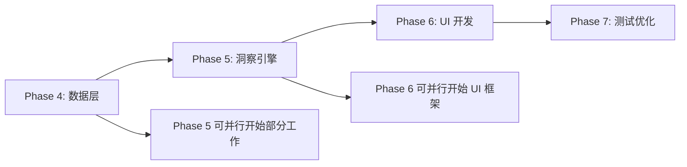

# 用户数据洞察系统 - 实施计划

> 基于 `User_Insight_System_Design.md` 设计文档
> 更新时间: 2026-01-24

---

## 总体架构

```
┌─────────────────────────────────────────────────────────────────┐
│                        用户输入文本                              │
└──────────────────────────┬──────────────────────────────────────┘
                           │
                           ▼
┌─────────────────────────────────────────────────────────────────┐
│              BertFeatureExtractor.mlpackage (静态)               │
│                       → 512维 Embedding                         │
└──────────────────────────┬──────────────────────────────────────┘
                           │
    ┌────────┬────────┬────┴────┬────────┬────────┬────────┐
    ▼        ▼        ▼         ▼        ▼        ▼        ▼
┌───────┐┌───────┐┌───────┐┌───────┐┌───────┐┌───────┐┌───────┐
│Topic  ││Senti- ││Urgency││Time-  ││Action-││Diffi- ││Speci- │
│(16cls)││ment   ││(3cls) ││Frame  ││Type   ││culty  ││ficity │
│  ✏️   ││(3cls) ││  ✏️   ││(4cls) ││(6cls) ││(3cls) ││(3cls) │
│       ││  ✏️   ││       ││  ✏️   ││  ✏️   ││  ✏️   ││  ✏️   │
└───┬───┘└───┬───┘└───┬───┘└───┬───┘└───┬───┘└───┬───┘└───┬───┘
    │        │        │        │        │        │        │
    └────────┴────────┴────┬───┴────────┴────────┴────────┘
                           │
                           ▼
┌─────────────────────────────────────────────────────────────────┐
│                    GoalDataAggregator                           │
│                   (Core Data / SQLite)                          │
└──────────────────────────┬──────────────────────────────────────┘
                           │
    ┌──────────────────────┼──────────────────────┐
    ▼                      ▼                      ▼
┌───────────┐       ┌───────────┐          ┌───────────┐
│Pattern    │       │Balance    │          │Trend      │
│Analyzer   │       │Advisor    │          │Analyzer   │
└─────┬─────┘       └─────┬─────┘          └─────┬─────┘
      │                   │                      │
      └───────────────────┼──────────────────────┘
                          ▼
┌─────────────────────────────────────────────────────────────────┐
│                    InsightGenerator                             │
│                  (规则引擎 + 模板系统)                           │
└──────────────────────────┬──────────────────────────────────────┘
                           │
                           ▼
┌─────────────────────────────────────────────────────────────────┐
│                   InsightDashboardView                          │
│               (洞察卡片 + 趋势图表 + 统计)                       │
└─────────────────────────────────────────────────────────────────┘
```

---

## Phase 4: iOS 数据层

### 4.1 目标

实现用户目标数据的持久化存储和聚合查询。

### 4.2 技术选型

| 方案 | 推荐 | 理由 |
|------|------|------|
| **Core Data** | ✅ | 官方支持, 与 SwiftUI 集成好, 支持 CloudKit |
| SQLite | ⭐ | 轻量, 跨平台, 查询灵活 |
| GRDB | ⭐ | Swift 友好的 SQLite 封装 |

**推荐: Core Data** (可选 GRDB 作为备选)

### 4.3 数据模型设计

```swift
// GoalRecord.swift
import Foundation
import CoreData

@objc(GoalRecord)
public class GoalRecord: NSManagedObject {
    @NSManaged public var id: UUID
    @NSManaged public var text: String
    @NSManaged public var timestamp: Date
    @NSManaged public var embedding: Data?
    
    // 分类结果 (7个维度)
    @NSManaged public var topic: String?
    @NSManaged public var topicConfidence: Float
    @NSManaged public var sentiment: String?
    @NSManaged public var sentimentConfidence: Float
    @NSManaged public var urgency: String?
    @NSManaged public var urgencyConfidence: Float
    @NSManaged public var timeFrame: String?
    @NSManaged public var timeFrameConfidence: Float
    @NSManaged public var actionType: String?
    @NSManaged public var actionTypeConfidence: Float
    @NSManaged public var difficulty: String?
    @NSManaged public var difficultyConfidence: Float
    @NSManaged public var specificity: String?
    @NSManaged public var specificityConfidence: Float
    
    // 用户反馈
    @NSManaged public var isCompleted: NSNumber?
    @NSManaged public var completedAt: Date?
    @NSManaged public var userRating: Int16
    
    // 用户纠正
    @NSManaged public var userCorrectedTopic: String?
    @NSManaged public var userCorrectedSentiment: String?
    // ... 其他纠正字段
}
```

### 4.4 GoalDataAggregator 接口

```swift
// GoalDataAggregator.swift
protocol GoalDataAggregating {
    /// 获取指定时间范围的统计数据
    func getAggregatedStats(from: Date, to: Date) -> AggregatedStats
    
    /// 获取主题分布
    func getTopicDistribution(period: TimePeriod) -> [String: Int]
    
    /// 获取情感趋势
    func getSentimentTrend(days: Int) -> [DailySentiment]
    
    /// 获取完成率
    func getCompletionRate(groupBy: String, period: TimePeriod) -> [String: Double]
    
    /// 获取相似目标
    func getSimilarGoals(embedding: [Float], limit: Int) -> [GoalRecord]
}

struct AggregatedStats {
    let totalGoals: Int
    let completedGoals: Int
    let completionRate: Double
    let topicDistribution: [String: Int]
    let sentimentDistribution: [String: Int]
    let urgencyDistribution: [String: Int]
    let actionTypeDistribution: [String: Int]
    let difficultyDistribution: [String: Int]
    let specificityDistribution: [String: Int]
}
```

### 4.5 实施步骤

1. **创建 Core Data 模型文件** (`MorningGoal.xcdatamodeld`)
2. **定义 GoalRecord 实体及属性**
3. **创建 CoreDataStack 管理类**
4. **实现 GoalDataAggregator**
5. **添加单元测试**

---

## Phase 5: 洞察生成引擎

### 5.1 目标

基于规则引擎生成个性化用户洞察。

### 5.2 技术选型

采用 **混合架构** (设计文档 8.4 推荐方案):

| 层级 | 技术 | 覆盖场景 |
|------|------|---------|
| **第一层** | 规则引擎 | 实时统计洞察、模式提醒、趋势警告 |
| **第二层** | 端侧 LLM (可选) | 目标优化建议、个性化鼓励 (iOS 18.1+) |
| **第三层** | 云端 LLM (可选) | 周报/月报深度分析 |

**MVP 阶段: 仅实现第一层规则引擎**

### 5.3 洞察类型

```swift
enum InsightType: String, CaseIterable {
    case pattern        // 模式识别: "您通常在周一设定最多运动目标"
    case balance        // 平衡建议: "本周工作目标占比80%"
    case trend          // 趋势分析: "近期积极情绪目标增加30%"
    case achievability  // 可达成性评估: "这个目标可能过于宏大"
    case completion     // 完成率预测: "类似目标历史完成率65%"
    case comparison     // 同期对比: "比上周多设定了3个目标"
    case encouragement  // 鼓励激励: "您已连续7天设定目标"
}
```

### 5.4 洞察模板示例

```swift
let insightTemplates: [InsightTemplate] = [
    // 模式识别
    InsightTemplate(
        id: "weekday_pattern",
        type: .pattern,
        condition: { stats, _ in hasWeekdayPattern(stats) },
        titleTemplate: "发现周期模式",
        descriptionTemplate: "您通常在{weekday}设定较多{topic}类目标"
    ),
    
    // 平衡建议
    InsightTemplate(
        id: "type_imbalance",
        type: .balance,
        condition: { stats, _ in stats.actionTypeDistribution.values.max()! > stats.totalGoals * 0.6 },
        titleTemplate: "目标类型较为集中",
        descriptionTemplate: "本周{actionType}类目标占比{percentage}%，建议适当增加{suggestion}类目标"
    ),
    
    // 趋势分析
    InsightTemplate(
        id: "sentiment_up",
        type: .trend,
        condition: { stats, _ in stats.sentimentChange > 0.15 },
        titleTemplate: "积极趋势",
        descriptionTemplate: "近一周积极情绪占比提升了{change}%，继续保持！"
    ),
    
    // 可达成性评估
    InsightTemplate(
        id: "goal_too_vague",
        type: .achievability,
        condition: { _, goal in goal?.difficulty == "hard" && goal?.specificity == "vague" },
        titleTemplate: "目标可能需要细化",
        descriptionTemplate: "这个目标有挑战性但描述较为模糊，具体化的目标更容易实现"
    ),
    
    // 完成率预测
    InsightTemplate(
        id: "low_completion_warning",
        type: .completion,
        condition: { stats, goal in getSimilarCompletionRate(goal) < 0.3 },
        titleTemplate: "历史参考",
        descriptionTemplate: "类似目标历史完成率为{rate}%，可以考虑调整或分解目标"
    ),
    
    // 鼓励激励
    InsightTemplate(
        id: "streak_encouragement",
        type: .encouragement,
        condition: { stats, _ in stats.consecutiveDays >= 7 },
        titleTemplate: "坚持的力量",
        descriptionTemplate: "您已连续{days}天设定目标，太棒了！"
    ),
]
```

### 5.5 InsightGenerator 实现

```swift
class InsightGenerator {
    let patternAnalyzer = PatternAnalyzer()
    let balanceAdvisor = BalanceAdvisor()
    let trendAnalyzer = TrendAnalyzer()
    let achievabilityPredictor = AchievabilityPredictor()
    
    func generateInsights(
        for goal: GoalRecord?,
        stats: AggregatedStats,
        historicalRecords: [GoalRecord]
    ) -> [Insight] {
        var allInsights: [Insight] = []
        
        // 1. 针对当前目标的洞察
        if let goal = goal {
            allInsights += achievabilityPredictor.evaluateGoal(goal: goal, historicalRecords: historicalRecords)
        }
        
        // 2. 周期性洞察
        allInsights += patternAnalyzer.analyzeWeekdayPatterns(records: historicalRecords)
        allInsights += balanceAdvisor.checkBalance(stats: stats)
        
        // 3. 趋势洞察
        let dailyStats = aggregateToDailyStats(historicalRecords)
        allInsights += trendAnalyzer.analyzeSentimentTrend(dailyStats: dailyStats)
        
        // 4. 按优先级排序，返回 Top-5
        return allInsights
            .sorted { $0.priority > $1.priority }
            .prefix(5)
            .map { $0 }
    }
}
```

### 5.6 实施步骤

1. **定义 Insight 数据结构**
2. **实现 PatternAnalyzer**
3. **实现 BalanceAdvisor**
4. **实现 TrendAnalyzer**
5. **实现 AchievabilityPredictor**
6. **实现 InsightGenerator**
7. **创建洞察模板库**
8. **添加单元测试**

---

## Phase 6: UI 开发

### 6.1 目标

创建洞察展示界面，提供直观的数据可视化。

### 6.2 技术选型

| 组件 | 技术 | 说明 |
|------|------|------|
| UI 框架 | SwiftUI | 声明式 UI, 与 iOS 16+ 特性兼容 |
| 图表 | Swift Charts | iOS 16+ 原生图表库 |
| 动画 | SwiftUI Animation | 流畅的过渡动画 |

### 6.3 UI 组件结构

```
InsightDashboardView
├── QuickStatsCard          # 快速统计卡片
│   ├── 今日目标数
│   ├── 本周完成率
│   └── 连续天数
├── InsightListView         # 洞察列表
│   └── InsightCard         # 单个洞察卡片
│       ├── 图标 + 标题
│       ├── 描述
│       └── 行动建议 (可选)
├── SentimentTrendChart     # 情感趋势图
└── GoalDistributionChart   # 目标分布饼图
```

### 6.4 InsightCard 设计

```swift
struct InsightCard: View {
    let insight: Insight
    
    var body: some View {
        VStack(alignment: .leading, spacing: 8) {
            HStack {
                Image(systemName: insight.type.iconName)
                    .foregroundColor(insight.type.color)
                Text(insight.title)
                    .font(.headline)
                Spacer()
            }
            
            Text(insight.description)
                .font(.body)
                .foregroundColor(.secondary)
            
            if let suggestion = insight.actionSuggestion {
                HStack {
                    Image(systemName: "lightbulb.fill")
                        .foregroundColor(.yellow)
                    Text(suggestion)
                        .font(.callout)
                        .foregroundColor(.blue)
                }
            }
        }
        .padding()
        .background(Color(.systemBackground))
        .cornerRadius(12)
        .shadow(radius: 2)
    }
}
```

### 6.5 趋势图表

```swift
import Charts

struct SentimentTrendChart: View {
    let data: [DailySentiment]
    
    var body: some View {
        Chart(data) { item in
            LineMark(
                x: .value("Date", item.date),
                y: .value("Positive %", item.positiveRatio)
            )
            .foregroundStyle(Color.green)
            
            AreaMark(
                x: .value("Date", item.date),
                y: .value("Positive %", item.positiveRatio)
            )
            .foregroundStyle(
                LinearGradient(
                    colors: [Color.green.opacity(0.3), Color.clear],
                    startPoint: .top,
                    endPoint: .bottom
                )
            )
        }
        .chartYScale(domain: 0...1)
        .frame(height: 200)
    }
}
```

### 6.6 实施步骤

1. **创建 InsightDashboardView 主视图**
2. **实现 QuickStatsCard 组件**
3. **实现 InsightCard 组件**
4. **实现 SentimentTrendChart**
5. **实现 GoalDistributionChart**
6. **创建 InsightViewModel**
7. **添加动画和交互**
8. **适配深色模式**

---

## Phase 7: 测试 & 优化

### 7.1 测试计划

| 测试类型 | 覆盖范围 | 工具 |
|---------|---------|------|
| 单元测试 | Aggregator, Analyzers | XCTest |
| 集成测试 | 端到端分类流程 | XCTest |
| UI 测试 | 关键用户流程 | XCUITest |
| 性能测试 | 推理延迟、内存 | Instruments |

### 7.2 性能目标

| 指标 | 目标值 | 测试方法 |
|-----|-------|---------|
| 7个分类器推理延迟 | < 50ms | Instruments Time Profiler |
| 洞察生成延迟 | < 100ms | 单元测试计时 |
| 内存占用增量 | < 20MB | Instruments Allocations |
| 电池消耗 | 无明显增加 | Energy Log |

### 7.3 优化策略

1. **推理优化**
   - 使用 `DispatchGroup` 并行执行 7 个分类器
   - 预加载模型到内存
   - 使用 Neural Engine (ANE) 加速

2. **内存优化**
   - 延迟加载分类器
   - 使用 `@autoreleasepool` 控制临时对象
   - 限制 embedding 缓存数量

3. **电池优化**
   - 批量处理洞察计算
   - 使用 Background Tasks API

---

## 时间规划

### 里程碑

| 阶段 | 预计工时 | 优先级 |
|-----|---------|-------|
| Phase 4: 数据层 | 3-4 天 | P0 |
| Phase 5: 洞察引擎 | 4-5 天 | P0 |
| Phase 6: UI 开发 | 4-5 天 | P1 |
| Phase 7: 测试优化 | 3-4 天 | P1 |
| **总计** | **14-18 天** | - |

### 依赖关系



---

## 风险与缓解

| 风险 | 影响 | 缓解措施 |
|-----|------|---------|
| 分类器准确率不足 | 洞察质量差 | 收集用户反馈, 端侧更新 |
| 推理延迟过高 | 用户体验差 | 使用 ANE, 异步加载 |
| 规则覆盖不全 | 洞察类型有限 | 模板系统可扩展, 后续迭代 |
| 数据不足 | 洞察不准确 | 设置最小数据量阈值 |

---

## 后续迭代 (V1.1+)

| 版本 | 功能 | 优先级 |
|-----|------|-------|
| V1.1 | 集成 Apple Intelligence (iOS 18.1+) | P1 |
| V1.2 | 云端 LLM 周报功能 | P2 |
| V2.0 | 完整混合架构 (规则 + 端侧 + 云端) | P3 |
| V2.1 | 社交对比功能 (可选) | P3 |
