# 用户数据洞察系统设计文档

## 目录

1. [概述](#1-概述)
2. [现有架构回顾](#2-现有架构回顾)
3. [洞察功能需求分析](#3-洞察功能需求分析)
4. [系统架构设计](#4-系统架构设计)
5. [新增分类维度](#5-新增分类维度)
6. [数据聚合层设计](#6-数据聚合层设计)
7. [洞察生成引擎](#7-洞察生成引擎)
8. [洞察生成技术选型：规则引擎 vs LLM](#8-洞察生成技术选型规则引擎-vs-llm)
9. [端侧实现方案](#9-端侧实现方案)
10. [训练与部署流程](#10-训练与部署流程)
11. [实施路线图](#11-实施路线图)

---

## 1. 概述

### 1.1 项目背景

当前项目已使用扇出架构 (Fan-out Architecture) 实现了端侧可更新的多任务分类模型：
- **BertFeatureExtractor**: 静态特征提取器
- **TopicClassifier**: 主题分类（16类）
- **SentimentClassifier**: 情感分类（3类）

### 1.2 扩展目标

在现有架构基础上，增加 **用户数据洞察功能**：

| 功能 | 描述 |
|-----|------|
| **周期性分析** | 对用户日/周/月的目标输入进行统计分析 |
| **个性化指导** | 基于用户行为模式提供改进建议 |
| **目标优化** | 帮助用户设定更合理、更可达成的目标 |
| **趋势追踪** | 追踪用户的进步和变化趋势 |

### 1.3 设计原则

1. **端侧优先**: 所有分析在设备本地完成，保护用户隐私
2. **增量扩展**: 复用现有扇出架构，只新增分类头
3. **低延迟**: 洞察生成应在毫秒级完成
4. **可个性化**: 支持端侧训练，适应用户习惯

---

## 2. 现有架构回顾

### 2.1 扇出架构示意图

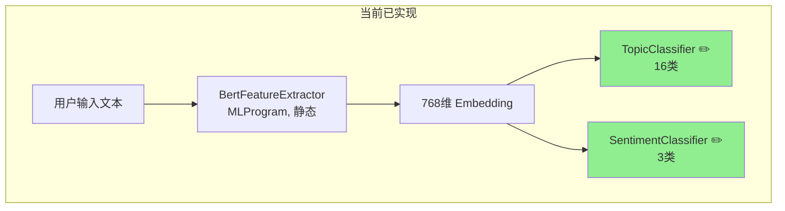

### 2.2 现有模型文件

```
models/exported_coreml/
├── BertFeatureExtractor.mlpackage    # ~50MB, 静态
├── TopicClassifier_Updatable.mlpackage   # ~50KB, 可更新
└── SentimentClassifier_Updatable.mlpackage  # ~10KB, 可更新
```

### 2.3 当前能力

| 维度 | 类别 | 用途 |
|-----|------|------|
| Topic | 16类 | 目标主题分类（学习、健康、工作等） |
| Sentiment | 3类 | 情感倾向（积极/中性/消极） |

---

## 3. 洞察功能需求分析

### 3.1 用户场景

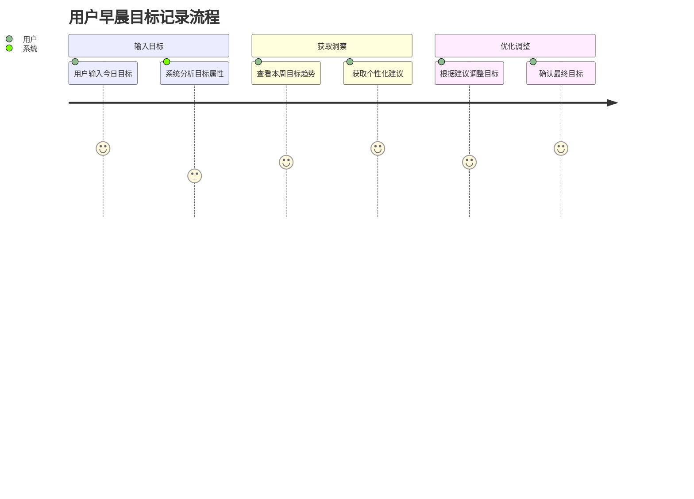

### 3.2 核心洞察类型

| 洞察类型 | 描述 | 示例 |
|---------|------|------|
| **模式识别** | 识别用户的目标设定模式 | "您通常在周一设定最多运动目标" |
| **平衡建议** | 建议目标类型的平衡 | "本周工作目标占比80%，建议增加生活类目标" |
| **可达成性评估** | 评估目标的合理性 | "这个目标可能过于宏大，建议拆分" |
| **趋势分析** | 分析情感和主题变化趋势 | "近期积极情绪目标增加30%" |
| **完成率预测** | 基于历史预测完成可能性 | "类似目标您的历史完成率为65%" |

### 3.3 所需数据维度

为了生成上述洞察，需要对每个目标输入提取以下维度：

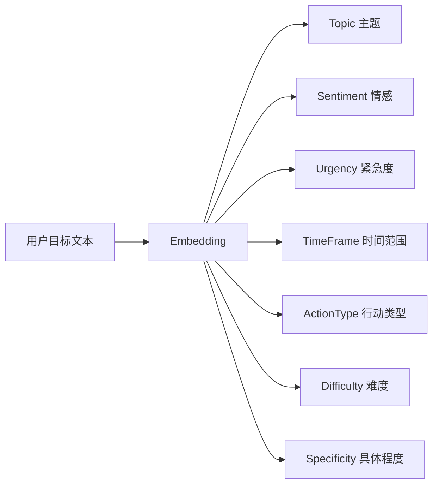

---

## 4. 系统架构设计

### 4.1 完整系统架构

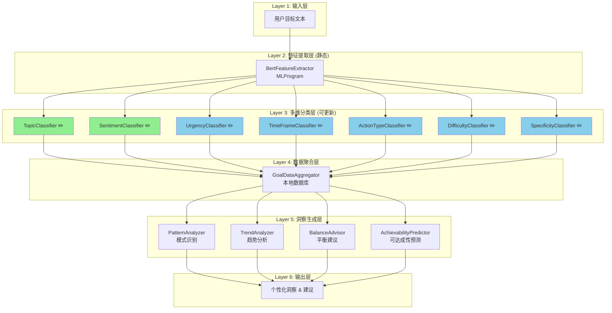

**图例**:
- 🟢 绿色: 已实现
- 🔵 蓝色: 待新增

### 4.2 数据流设计

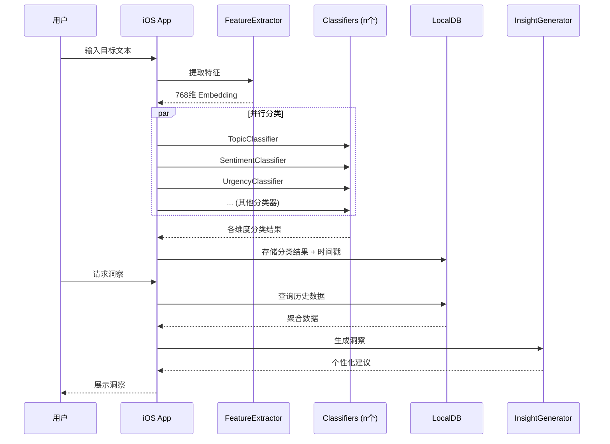

---

## 5. 新增分类维度

### 5.1 分类维度定义

| 维度 | 类别数 | 类别定义 | 训练数据来源 |
|-----|-------|---------|-------------|
| **Urgency** (紧急度) | 3 | `low`, `medium`, `high` | 基于关键词规则标注 |
| **TimeFrame** (时间范围) | 4 | `today`, `this_week`, `this_month`, `long_term` | 时间词提取 |
| **ActionType** (行动类型) | 6 | `learning`, `exercise`, `work`, `lifestyle`, `social`, `creative` | 主题细分 |
| **Difficulty** (难度) | 3 | `easy`, `moderate`, `hard` | LLM 辅助标注 |
| **Specificity** (具体程度) | 3 | `vague`, `moderate`, `specific` | 句子结构分析 |

### 5.2 类别详细说明

#### 5.2.1 Urgency (紧急度)

```python
URGENCY_LABELS = {
    0: "low",      # 没有时间压力，如"有空时整理房间"
    1: "medium",   # 有一定时间要求，如"这周完成报告"
    2: "high"      # 紧急任务，如"今天必须提交申请"
}
```

**标注规则**:
- `high`: 包含 "今天", "立即", "马上", "deadline", "紧急" 等
- `medium`: 包含 "本周", "这周", "尽快", "近期" 等
- `low`: 其他情况

#### 5.2.2 TimeFrame (时间范围)

```python
TIMEFRAME_LABELS = {
    0: "today",       # 当日目标
    1: "this_week",   # 本周目标
    2: "this_month",  # 本月目标
    3: "long_term"    # 长期目标
}
```

**标注规则**:
- 基于时间词提取: "今天/明天" → today, "本周/这周" → this_week, etc.

#### 5.2.3 ActionType (行动类型)

```python
ACTIONTYPE_LABELS = {
    0: "learning",   # 学习提升：读书、上课、考证
    1: "exercise",   # 运动健康：跑步、健身、作息
    2: "work",       # 工作事业：项目、会议、业务
    3: "lifestyle",  # 日常生活：家务、购物、理财
    4: "social",     # 社交关系：约会、聚会、探亲
    5: "creative"    # 创意爱好：写作、绘画、音乐
}
```

#### 5.2.4 Difficulty (难度)

```python
DIFFICULTY_LABELS = {
    0: "easy",      # 简单：耗时短、无技能门槛
    1: "moderate",  # 中等：需要一定时间或努力
    2: "hard"       # 困难：耗时长、有挑战性
}
```

#### 5.2.5 Specificity (具体程度)

```python
SPECIFICITY_LABELS = {
    0: "vague",     # 模糊："多运动"
    1: "moderate",  # 一般："每天运动"
    2: "specific"   # 具体："每天跑步3公里"
}
```

### 5.3 扇出架构扩展

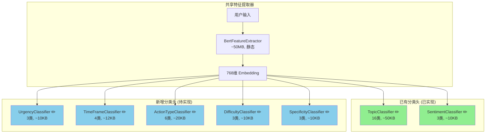

### 5.4 模型文件结构 (扩展后)

```
models/exported_coreml/
├── BertFeatureExtractor.mlpackage          # ~50MB, 静态, 共享
├── TopicClassifier_Updatable.mlpackage     # ~50KB, 可更新
├── SentimentClassifier_Updatable.mlpackage # ~10KB, 可更新
├── UrgencyClassifier_Updatable.mlpackage   # ~10KB, 可更新 [新增]
├── TimeFrameClassifier_Updatable.mlpackage # ~12KB, 可更新 [新增]
├── ActionTypeClassifier_Updatable.mlpackage# ~20KB, 可更新 [新增]
├── DifficultyClassifier_Updatable.mlpackage# ~10KB, 可更新 [新增]
└── SpecificityClassifier_Updatable.mlpackage# ~10KB, 可更新 [新增]
```

**总体积增量**: 新增约 62KB（可忽略不计）

---

## 6. 数据聚合层设计

### 6.1 本地数据库结构

使用 Core Data 或 SQLite 存储用户历史数据。

#### 6.1.1 GoalRecord 实体

```swift
struct GoalRecord {
    let id: UUID
    let text: String                // 原始目标文本
    let timestamp: Date             // 创建时间
    let embedding: Data             // 768维向量（可选，用于相似度计算）
    
    // 分类结果
    let topic: String               // 主题
    let sentiment: String           // 情感
    let urgency: String             // 紧急度
    let timeFrame: String           // 时间范围
    let actionType: String          // 行动类型
    let difficulty: String          // 难度
    let specificity: String         // 具体程度
    
    // 用户反馈
    var isCompleted: Bool?          // 是否完成
    var userCorrectedTopic: String? // 用户纠正的主题
    // ... 其他纠正字段
}
```

#### 6.1.2 数据库 Schema (SQLite)

```sql
CREATE TABLE goal_records (
    id TEXT PRIMARY KEY,
    text TEXT NOT NULL,
    timestamp INTEGER NOT NULL,
    embedding BLOB,
    
    -- 分类结果
    topic TEXT,
    topic_confidence REAL,
    sentiment TEXT,
    sentiment_confidence REAL,
    urgency TEXT,
    urgency_confidence REAL,
    time_frame TEXT,
    time_frame_confidence REAL,
    action_type TEXT,
    action_type_confidence REAL,
    difficulty TEXT,
    difficulty_confidence REAL,
    specificity TEXT,
    specificity_confidence REAL,
    
    -- 用户反馈
    is_completed INTEGER,
    completed_at INTEGER,
    user_rating INTEGER,
    
    -- 索引优化
    INDEX idx_timestamp (timestamp),
    INDEX idx_topic (topic),
    INDEX idx_action_type (action_type)
);

-- 聚合统计表（缓存）
CREATE TABLE aggregated_stats (
    period_type TEXT,           -- 'daily', 'weekly', 'monthly'
    period_start INTEGER,       -- 周期开始时间戳
    topic_distribution TEXT,    -- JSON: {"work": 5, "exercise": 3, ...}
    sentiment_distribution TEXT,
    urgency_distribution TEXT,
    action_type_distribution TEXT,
    total_goals INTEGER,
    completed_goals INTEGER,
    PRIMARY KEY (period_type, period_start)
);
```

### 6.2 聚合查询设计

```swift
class GoalDataAggregator {
    
    /// 获取指定时间范围的统计数据
    func getAggregatedStats(
        from startDate: Date,
        to endDate: Date
    ) -> AggregatedStats {
        // 按维度分组统计
    }
    
    /// 获取主题分布
    func getTopicDistribution(period: TimePeriod) -> [String: Int] {
        // SELECT topic, COUNT(*) FROM goal_records 
        // WHERE timestamp BETWEEN ? AND ? GROUP BY topic
    }
    
    /// 获取情感趋势
    func getSentimentTrend(days: Int) -> [DailySentiment] {
        // 每日积极/中性/消极比例
    }
    
    /// 获取目标完成率
    func getCompletionRate(
        groupBy dimension: String,
        period: TimePeriod
    ) -> [String: Double] {
        // 按维度分组的完成率
    }
    
    /// 获取相似目标
    func getSimilarGoals(embedding: [Float], limit: Int) -> [GoalRecord] {
        // 基于 embedding 的余弦相似度搜索
    }
}
```

### 6.3 数据聚合周期

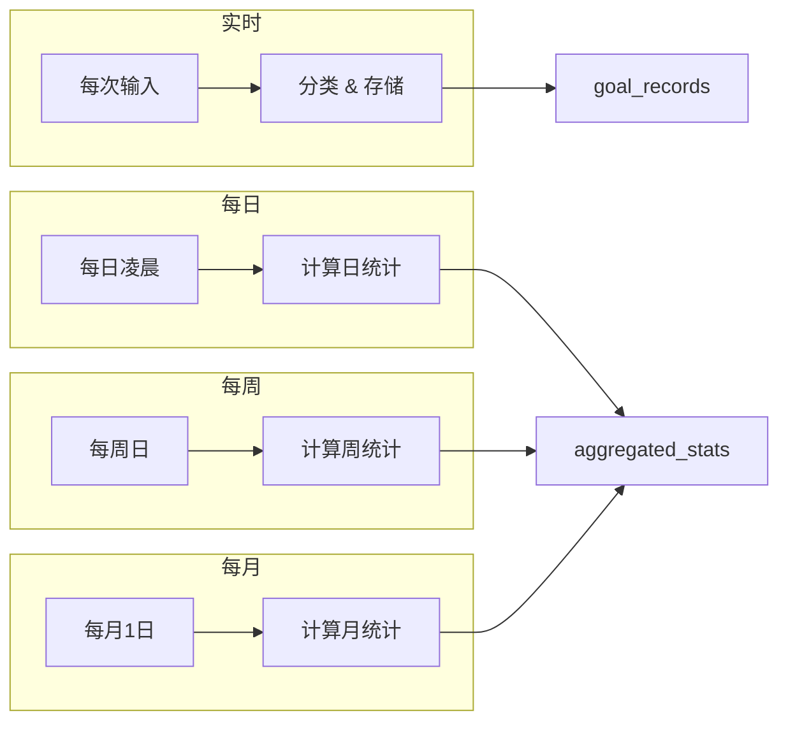

---

## 7. 洞察生成引擎

### 7.1 洞察类型定义

```swift
enum InsightType {
    case pattern          // 模式识别
    case balance          // 平衡建议
    case trend            // 趋势分析
    case achievability    // 可达成性
    case completion       // 完成率预测
    case comparison       // 同期对比
    case encouragement    // 鼓励激励
}

struct Insight {
    let type: InsightType
    let title: String
    let description: String
    let priority: Int           // 展示优先级
    let actionSuggestion: String?  // 可选的行动建议
    let relatedGoals: [GoalRecord]? // 相关目标
}
```

### 7.2 洞察生成规则引擎

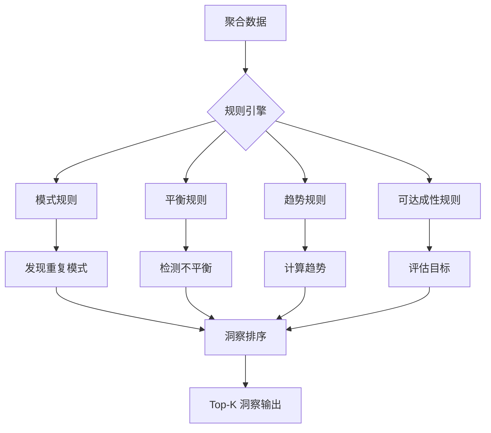

### 7.3 核心洞察规则

#### 7.3.1 模式识别规则

```swift
class PatternAnalyzer {
    
    /// 识别用户的周期性模式
    func analyzeWeekdayPatterns(records: [GoalRecord]) -> [Insight] {
        var insights: [Insight] = []
        
        // 按星期分组统计主题
        let weekdayTopics = groupByWeekday(records)
        
        // 检测显著模式
        for (weekday, topicCounts) in weekdayTopics {
            if let dominantTopic = findDominant(topicCounts, threshold: 0.5) {
                insights.append(Insight(
                    type: .pattern,
                    title: "发现周期模式",
                    description: "您通常在\(weekday.name)设定较多\(dominantTopic)类目标",
                    priority: 3,
                    actionSuggestion: nil
                ))
            }
        }
        
        return insights
    }
    
    /// 识别高频目标
    func findRecurringGoals(records: [GoalRecord], similarityThreshold: Float = 0.85) -> [Insight] {
        // 使用 embedding 找相似目标
        // 如果某类目标频繁出现但完成率低，生成提醒
    }
}
```

#### 7.3.2 平衡建议规则

```swift
class BalanceAdvisor {
    
    /// 检测目标类型不平衡
    func checkBalance(stats: AggregatedStats) -> [Insight] {
        var insights: [Insight] = []
        
        let actionTypeDistribution = stats.actionTypeDistribution
        let total = actionTypeDistribution.values.reduce(0, +)
        
        // 检测过于集中的类型
        for (actionType, count) in actionTypeDistribution {
            let ratio = Double(count) / Double(total)
            if ratio > 0.6 {
                insights.append(Insight(
                    type: .balance,
                    title: "目标类型较为集中",
                    description: "本周\(actionType)类目标占比\(Int(ratio * 100))%，建议适当增加其他生活领域的目标",
                    priority: 4,
                    actionSuggestion: "尝试添加一个\(suggestComplementary(actionType))类目标"
                ))
            }
        }
        
        // 检测缺失的类型
        let missingTypes = ActionType.allCases.filter { 
            actionTypeDistribution[$0.rawValue] == nil || actionTypeDistribution[$0.rawValue]! < 1
        }
        
        if missingTypes.count >= 3 {
            insights.append(Insight(
                type: .balance,
                title: "生活平衡建议",
                description: "您近期较少设定\(missingTypes.prefix(2).map(\.name).joined(separator: "、"))类目标",
                priority: 2,
                actionSuggestion: nil
            ))
        }
        
        return insights
    }
    
    private func suggestComplementary(_ type: String) -> String {
        switch type {
        case "work": return "运动或社交"
        case "exercise": return "学习或创意"
        case "learning": return "社交或生活"
        default: return "其他"
        }
    }
}
```

#### 7.3.3 趋势分析规则

```swift
class TrendAnalyzer {
    
    /// 分析情感趋势
    func analyzeSentimentTrend(dailyStats: [DailyStats]) -> [Insight] {
        var insights: [Insight] = []
        
        guard dailyStats.count >= 7 else { return insights }
        
        // 计算近7天 vs 前7天的积极情绪比例变化
        let recent = dailyStats.suffix(7)
        let previous = dailyStats.dropLast(7).suffix(7)
        
        let recentPositiveRatio = calculatePositiveRatio(recent)
        let previousPositiveRatio = calculatePositiveRatio(previous)
        
        let change = recentPositiveRatio - previousPositiveRatio
        
        if change > 0.15 {
            insights.append(Insight(
                type: .trend,
                title: "积极趋势 📈",
                description: "近一周您的目标中积极情绪占比提升了\(Int(change * 100))%，继续保持！",
                priority: 5,
                actionSuggestion: nil
            ))
        } else if change < -0.15 {
            insights.append(Insight(
                type: .trend,
                title: "情绪变化提醒",
                description: "近期目标中的积极表述有所减少，需要关注自己的状态吗？",
                priority: 4,
                actionSuggestion: "尝试设定一个让自己开心的小目标"
            ))
        }
        
        return insights
    }
    
    /// 分析目标数量趋势
    func analyzeVolumetrend(dailyStats: [DailyStats]) -> [Insight] {
        // 检测目标设定频率变化
    }
}
```

#### 7.3.4 可达成性评估规则

```swift
class AchievabilityPredictor {
    
    /// 评估当前目标的可达成性
    func evaluateGoal(
        goal: GoalRecord,
        historicalRecords: [GoalRecord]
    ) -> [Insight] {
        var insights: [Insight] = []
        
        // 1. 基于难度和具体程度评估
        if goal.difficulty == "hard" && goal.specificity == "vague" {
            insights.append(Insight(
                type: .achievability,
                title: "目标可能需要细化",
                description: "这个目标看起来有挑战性，但描述较为模糊。具体化的目标更容易实现！",
                priority: 5,
                actionSuggestion: "试试添加具体的时间、数量或步骤"
            ))
        }
        
        // 2. 基于历史完成率评估
        let similarGoals = findSimilarHistoricalGoals(goal, in: historicalRecords)
        if !similarGoals.isEmpty {
            let completionRate = calculateCompletionRate(similarGoals)
            
            if completionRate < 0.3 {
                insights.append(Insight(
                    type: .achievability,
                    title: "历史参考",
                    description: "类似目标您的历史完成率为\(Int(completionRate * 100))%，可以考虑调整或分解目标",
                    priority: 4,
                    actionSuggestion: "尝试将目标拆分为更小的步骤"
                ))
            } else if completionRate > 0.8 {
                insights.append(Insight(
                    type: .encouragement,
                    title: "信心满满",
                    description: "类似目标您通常都能完成，继续加油！",
                    priority: 2,
                    actionSuggestion: nil
                ))
            }
        }
        
        // 3. 基于当日目标数量评估
        let todayGoals = getTodayGoals(from: historicalRecords)
        if todayGoals.count >= 5 && goal.urgency == "high" {
            insights.append(Insight(
                type: .achievability,
                title: "今日目标较多",
                description: "您今天已设定\(todayGoals.count)个目标，其中包含紧急任务，注意合理安排时间",
                priority: 4,
                actionSuggestion: "考虑将部分任务延后到明天"
            ))
        }
        
        return insights
    }
}
```

### 7.4 洞察优先级与展示

```swift
class InsightGenerator {
    
    let patternAnalyzer = PatternAnalyzer()
    let balanceAdvisor = BalanceAdvisor()
    let trendAnalyzer = TrendAnalyzer()
    let achievabilityPredictor = AchievabilityPredictor()
    
    /// 生成综合洞察
    func generateInsights(
        for goal: GoalRecord?,
        stats: AggregatedStats,
        historicalRecords: [GoalRecord]
    ) -> [Insight] {
        var allInsights: [Insight] = []
        
        // 1. 针对当前目标的洞察
        if let goal = goal {
            allInsights += achievabilityPredictor.evaluateGoal(
                goal: goal,
                historicalRecords: historicalRecords
            )
        }
        
        // 2. 周期性洞察
        allInsights += patternAnalyzer.analyzeWeekdayPatterns(records: historicalRecords)
        allInsights += balanceAdvisor.checkBalance(stats: stats)
        
        // 3. 趋势洞察
        let dailyStats = aggregateToDailyStats(historicalRecords)
        allInsights += trendAnalyzer.analyzeSentimentTrend(dailyStats: dailyStats)
        
        // 4. 按优先级排序，返回 Top-K
        return allInsights
            .sorted { $0.priority > $1.priority }
            .prefix(5)
            .map { $0 }
    }
}
```

### 7.5 洞察模板系统

```swift
struct InsightTemplate {
    let id: String
    let type: InsightType
    let condition: (AggregatedStats, GoalRecord?) -> Bool
    let titleTemplate: String
    let descriptionTemplate: String
    let variables: [String]  // 模板变量
}

// 预定义模板
let insightTemplates: [InsightTemplate] = [
    InsightTemplate(
        id: "weekly_dominant_topic",
        type: .pattern,
        condition: { stats, _ in 
            stats.topicDistribution.values.max()! > stats.totalGoals * 0.5
        },
        titleTemplate: "本周主题聚焦",
        descriptionTemplate: "您本周设定了{count}个{topic}相关目标，占比{percentage}%",
        variables: ["count", "topic", "percentage"]
    ),
    InsightTemplate(
        id: "sentiment_improvement",
        type: .trend,
        condition: { stats, _ in 
            // 积极情绪增长
            true
        },
        titleTemplate: "情绪向好",
        descriptionTemplate: "近期您的目标表述更加积极，提升了{percentage}%",
        variables: ["percentage"]
    ),
    // ... 更多模板
]
```

---

## 8. 洞察生成技术选型：规则引擎 vs LLM

### 8.1 技术方案对比

生成用户数据洞察有多种技术路径，需要根据场景特点选择合适的方案。

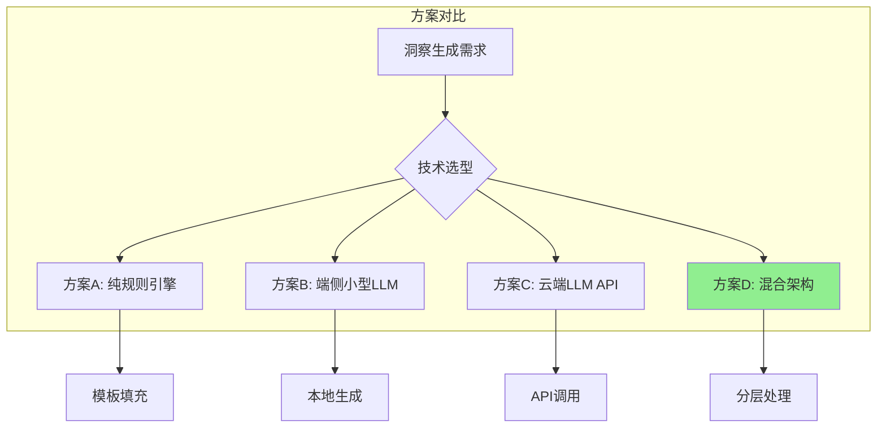

### 8.2 四种方案详解

#### 方案 A: 纯规则引擎 + 模板系统

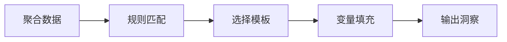

**实现示例**:

```swift
// 规则定义
struct InsightRule {
    let id: String
    let condition: (AggregatedStats) -> Bool
    let template: String
    let variables: (AggregatedStats) -> [String: Any]
}

let rules: [InsightRule] = [
    InsightRule(
        id: "work_overload",
        condition: { stats in 
            let workRatio = stats.actionTypeDistribution["work"]! / stats.total
            return workRatio > 0.6
        },
        template: "本周工作类目标占比{percentage}%，建议适当增加{suggestion}类目标来平衡生活",
        variables: { stats in
            ["percentage": Int(workRatio * 100), "suggestion": "运动或休闲"]
        }
    ),
    // 更多规则...
]

// 生成洞察
func generateInsight(stats: AggregatedStats) -> String {
    for rule in rules {
        if rule.condition(stats) {
            return fillTemplate(rule.template, with: rule.variables(stats))
        }
    }
    return "暂无洞察"
}
```

| 优点 | 缺点 |
|-----|-----|
| ✅ 完全端侧运行，无网络依赖 | ❌ 表达固定，缺乏自然语言多样性 |
| ✅ 响应速度极快 (< 1ms) | ❌ 难以处理复杂/开放式场景 |
| ✅ 零额外成本 | ❌ 需要大量人工编写规则和模板 |
| ✅ 结果可预测、可控 | ❌ 个性化程度有限 |
| ✅ 隐私完全保护 | ❌ 扩展新洞察类型需要开发 |

**适用场景**: 洞察类型明确、模式固定的场景

---

#### 方案 B: 端侧小型 LLM

使用如 Apple Intelligence、Phi-3-mini、Gemma-2B 等小模型在设备本地生成洞察。

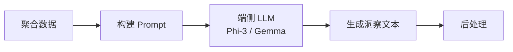

**实现示例 (使用 Apple Intelligence / Core ML)**:

```swift
import CoreML

class OnDeviceLLMInsightGenerator {
    private let model: MLModel  // 量化后的小型 LLM
    
    func generateInsight(stats: AggregatedStats) async -> String {
        let prompt = buildPrompt(stats)
        
        // 使用端侧 LLM 生成
        let input = try! MLDictionaryFeatureProvider(dictionary: [
            "prompt": MLFeatureValue(string: prompt)
        ])
        
        let output = try! await model.prediction(from: input)
        return output.featureValue(for: "generated_text")!.stringValue
    }
    
    private func buildPrompt(_ stats: AggregatedStats) -> String {
        """
        你是一个目标管理助手。根据以下用户数据，提供一条简短的个性化建议（不超过50字）。
        
        用户本周数据：
        - 设定目标数：\(stats.totalGoals)
        - 完成率：\(stats.completionRate)%
        - 目标分布：工作\(stats.workRatio)%，学习\(stats.learningRatio)%，运动\(stats.exerciseRatio)%
        - 情感倾向：积极\(stats.positiveRatio)%
        
        请给出建议：
        """
    }
}
```

| 优点 | 缺点 |
|-----|-----|
| ✅ 生成自然、多样化的文本 | ❌ 模型体积大 (1-4GB) |
| ✅ 隐私保护（本地运行） | ❌ 推理较慢 (1-5秒) |
| ✅ 可处理复杂场景 | ❌ 需要较新设备 (A14+/M1+) |
| ✅ 无 API 成本 | ❌ 输出质量不如大模型 |

**可选模型**:

| 模型 | 大小 | 特点 |
|-----|-----|------|
| Apple Intelligence (iOS 18.1+) | 系统内置 | 官方支持，无需额外集成 |
| Phi-3-mini (量化) | ~1.5GB | 微软出品，中文能力一般 |
| Gemma-2B (量化) | ~1.2GB | Google 出品，需要转换 |
| Qwen-1.8B (量化) | ~1GB | 阿里出品，中文能力强 |

**适用场景**: 需要自然语言生成、设备性能足够、对隐私要求高

---

#### 方案 C: 云端 LLM API

调用 GPT-4、Claude、通义千问等云端 API 生成洞察。

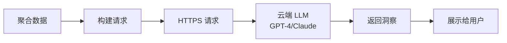

**实现示例**:

```swift
import Foundation

class CloudLLMInsightGenerator {
    private let apiKey: String
    private let endpoint = "https://api.openai.com/v1/chat/completions"
    
    func generateInsight(stats: AggregatedStats) async throws -> String {
        let prompt = buildDetailedPrompt(stats)
        
        let request = ChatCompletionRequest(
            model: "gpt-4o-mini",
            messages: [
                Message(role: "system", content: """
                    你是 Morning Goal 应用的智能助手，帮助用户分析目标设定习惯。
                    请根据用户数据提供：
                    1. 一个核心洞察（20字内）
                    2. 一条具体建议（30字内）
                    风格：温暖、鼓励、具体
                    """),
                Message(role: "user", content: prompt)
            ],
            maxTokens: 100
        )
        
        let response = try await sendRequest(request)
        return response.choices.first?.message.content ?? "暂无洞察"
    }
    
    private func buildDetailedPrompt(_ stats: AggregatedStats) -> String {
        """
        用户本周目标数据：
        
        📊 基础统计
        - 总目标数：\(stats.totalGoals)
        - 完成数：\(stats.completedGoals)
        - 完成率：\(String(format: "%.1f", stats.completionRate))%
        
        📂 目标类型分布
        \(stats.actionTypeDistribution.map { "- \($0.key): \($0.value)个" }.joined(separator: "\n"))
        
        😊 情感倾向
        - 积极：\(stats.positiveCount)个
        - 中性：\(stats.neutralCount)个
        - 消极：\(stats.negativeCount)个
        
        ⏰ 紧急度分布
        - 高：\(stats.highUrgency)个
        - 中：\(stats.mediumUrgency)个
        - 低：\(stats.lowUrgency)个
        
        📈 与上周对比
        - 目标数变化：\(stats.goalCountChange > 0 ? "+" : "")\(stats.goalCountChange)
        - 完成率变化：\(stats.completionRateChange > 0 ? "+" : "")\(String(format: "%.1f", stats.completionRateChange))%
        
        请分析并给出洞察。
        """
    }
}
```

| 优点 | 缺点 |
|-----|-----|
| ✅ 生成质量最高 | ❌ 需要网络连接 |
| ✅ 可处理任意复杂场景 | ❌ 有 API 成本 (约 $0.001/次) |
| ✅ 无需本地资源 | ❌ 数据需发送到云端（隐私风险） |
| ✅ 模型持续更新 | ❌ 延迟较高 (500ms-2s) |
| ✅ 支持多语言 | ❌ 依赖第三方服务 |

**成本估算**:

| 使用频率 | 月成本 (GPT-4o-mini) |
|---------|---------------------|
| 每日 1 次 | ~$0.03/月 |
| 每日 5 次 | ~$0.15/月 |
| 每周 1 次汇总 | ~$0.004/月 |

**适用场景**: 需要高质量自然语言、对隐私敏感度较低、有网络条件

---

#### 方案 D: 混合架构（推荐）

结合规则引擎和 LLM 的优势，分层处理不同类型的洞察。

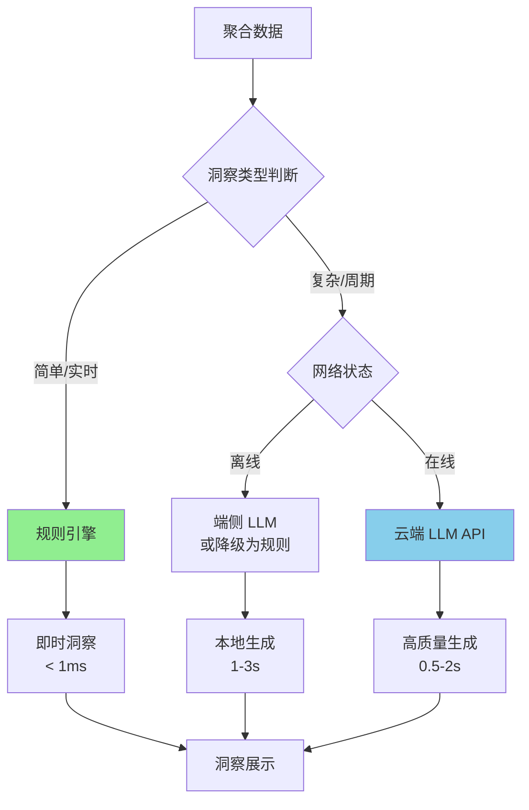

**分层策略**:

| 洞察类型 | 处理方式 | 示例 |
|---------|---------|------|
| **实时反馈** | 规则引擎 | "今日已设定5个目标" |
| **模式提醒** | 规则引擎 | "本周工作目标占比80%" |
| **趋势分析** | 规则引擎 | "积极情绪比上周提升15%" |
| **个性化建议** | LLM (可选) | "考虑到您最近工作压力较大，建议..." |
| **周报总结** | 云端 LLM | 每周一次的深度分析报告 |
| **目标优化建议** | LLM (可选) | "这个目标可以这样拆分..." |

**实现架构**:

```swift
class HybridInsightGenerator {
    
    private let ruleEngine = RuleBasedInsightEngine()
    private let onDeviceLLM: OnDeviceLLMInsightGenerator?
    private let cloudLLM = CloudLLMInsightGenerator()
    
    /// 生成洞察（混合策略）
    func generateInsights(
        for goal: GoalRecord?,
        stats: AggregatedStats,
        context: InsightContext
    ) async -> [Insight] {
        
        var insights: [Insight] = []
        
        // 1. 规则引擎：总是运行，生成基础洞察
        insights += ruleEngine.generate(stats: stats, goal: goal)
        
        // 2. 判断是否需要 LLM 增强
        let needsLLM = shouldUseLLM(context: context)
        
        if needsLLM {
            // 3. 选择 LLM 来源
            if context.isWeeklySummary {
                // 周报用云端 LLM（质量优先）
                if let cloudInsight = try? await cloudLLM.generateWeeklySummary(stats) {
                    insights.append(cloudInsight)
                }
            } else if context.needsPersonalizedAdvice {
                // 个性化建议：优先端侧，降级到云端
                if let localLLM = onDeviceLLM {
                    let advice = await localLLM.generateAdvice(goal: goal, stats: stats)
                    insights.append(advice)
                } else if NetworkMonitor.shared.isConnected {
                    let advice = try? await cloudLLM.generateAdvice(goal: goal, stats: stats)
                    if let advice = advice { insights.append(advice) }
                }
            }
        }
        
        return insights.sorted { $0.priority > $1.priority }
    }
    
    private func shouldUseLLM(context: InsightContext) -> Bool {
        // LLM 触发条件
        return context.isWeeklySummary ||
               context.needsPersonalizedAdvice ||
               context.hasComplexPattern ||
               context.userRequestedDeepAnalysis
    }
}

struct InsightContext {
    let isWeeklySummary: Bool
    let needsPersonalizedAdvice: Bool
    let hasComplexPattern: Bool
    let userRequestedDeepAnalysis: Bool
}
```

| 优点 | 缺点 |
|-----|-----|
| ✅ 兼顾速度和质量 | ⚠️ 实现复杂度较高 |
| ✅ 离线可用（降级） | ⚠️ 需要维护多套逻辑 |
| ✅ 成本可控 | ⚠️ 测试工作量增加 |
| ✅ 隐私与功能平衡 | |
| ✅ 渐进式增强 | |

---

### 8.3 技术选型决策矩阵

| 考量因素 | 方案A 规则引擎 | 方案B 端侧LLM | 方案C 云端LLM | 方案D 混合 |
|---------|--------------|--------------|--------------|-----------|
| **响应速度** | ⭐⭐⭐⭐⭐ | ⭐⭐ | ⭐⭐⭐ | ⭐⭐⭐⭐ |
| **生成质量** | ⭐⭐ | ⭐⭐⭐ | ⭐⭐⭐⭐⭐ | ⭐⭐⭐⭐ |
| **隐私保护** | ⭐⭐⭐⭐⭐ | ⭐⭐⭐⭐⭐ | ⭐⭐ | ⭐⭐⭐⭐ |
| **离线可用** | ⭐⭐⭐⭐⭐ | ⭐⭐⭐⭐⭐ | ⭐ | ⭐⭐⭐⭐ |
| **运营成本** | ⭐⭐⭐⭐⭐ | ⭐⭐⭐⭐ | ⭐⭐⭐ | ⭐⭐⭐⭐ |
| **开发成本** | ⭐⭐⭐ | ⭐⭐ | ⭐⭐⭐⭐ | ⭐⭐ |
| **设备兼容性** | ⭐⭐⭐⭐⭐ | ⭐⭐ | ⭐⭐⭐⭐⭐ | ⭐⭐⭐⭐ |
| **可扩展性** | ⭐⭐ | ⭐⭐⭐⭐ | ⭐⭐⭐⭐⭐ | ⭐⭐⭐⭐ |

### 8.4 推荐方案

> [!TIP]
> **针对 Morning Goal 应用的推荐：方案 D（混合架构）**

**具体策略**:

```
┌─────────────────────────────────────────────────────────────────┐
│                        洞察生成策略                              │
├─────────────────────────────────────────────────────────────────┤
│                                                                 │
│  第一层：规则引擎（必选，100%覆盖）                               │
│  ├── 实时统计洞察（目标数、完成率）                               │
│  ├── 模式提醒（类型分布不平衡）                                   │
│  ├── 趋势警告（情绪下降、目标减少）                               │
│  └── 基础建议（模板填充）                                        │
│                                                                 │
│  第二层：端侧 LLM（可选，iOS 18.1+ 设备）                         │
│  ├── 目标优化建议（用户点击"优化"时）                             │
│  └── 个性化鼓励（基于历史完成情况）                               │
│                                                                 │
│  第三层：云端 LLM（可选，用户授权 + 网络可用）                      │
│  ├── 周报/月报深度分析                                           │
│  └── 复杂问题解答（"为什么我总完不成运动目标？"）                   │
│                                                                 │
└─────────────────────────────────────────────────────────────────┘
```

**实施建议**:

| 阶段 | 内容 | 优先级 |
|-----|------|--------|
| **MVP** | 仅规则引擎，覆盖核心洞察场景 | P0 |
| **V1.1** | 集成 Apple Intelligence（iOS 18.1+） | P1 |
| **V1.2** | 可选云端 LLM（周报功能） | P2 |
| **V2.0** | 完整混合架构 | P3 |

### 8.5 Prompt 设计指南（用于 LLM 方案）

#### 8.5.1 系统 Prompt

```
你是 Morning Goal 应用的智能助手，帮助用户分析和优化每日目标设定。

你的特点：
- 温暖、鼓励的语气
- 简洁、有行动力的建议
- 关注用户的整体生活平衡
- 尊重用户的隐私和自主性

输出要求：
- 洞察部分：15-25字，一句话概括核心发现
- 建议部分：20-40字，给出具体可执行的行动
- 不要使用"您好"等寒暄
- 不要过度热情或使用过多emoji
```

#### 8.5.2 洞察生成 Prompt 模板

```
基于以下用户目标数据，生成一条洞察和建议：

【时间范围】{period}（如：本周 / 近30天）

【目标统计】
- 总数：{total_goals}
- 已完成：{completed_goals}（{completion_rate}%）
- 日均：{daily_average}

【类型分布】
{action_type_distribution}

【情感倾向】
- 积极表述：{positive_ratio}%
- 消极表述：{negative_ratio}%

【紧急度】
- 高紧急：{high_urgency_ratio}%

【历史对比】
- 目标数变化：{goal_change}%
- 完成率变化：{completion_change}%

请输出：
1. 洞察：（一句话核心发现）
2. 建议：（具体可执行的行动）
```

#### 8.5.3 目标优化 Prompt

```
用户刚刚输入了一个目标，请帮助优化：

【原始目标】
{user_goal}

【目标分析】
- 主题：{topic}
- 情感：{sentiment}
- 紧急度：{urgency}
- 时间范围：{time_frame}
- 难度：{difficulty}
- 具体程度：{specificity}

【历史参考】
- 类似目标历史完成率：{similar_completion_rate}%
- 今日已有目标数：{today_goal_count}

请提供：
1. 一句话评估（这个目标是否合理）
2. 如果需要优化，给出优化建议（更具体/更可拆分/更现实）
3. 如果目标很好，给出鼓励
```

---

## 9. 端侧实现方案

### 9.1 iOS 架构设计

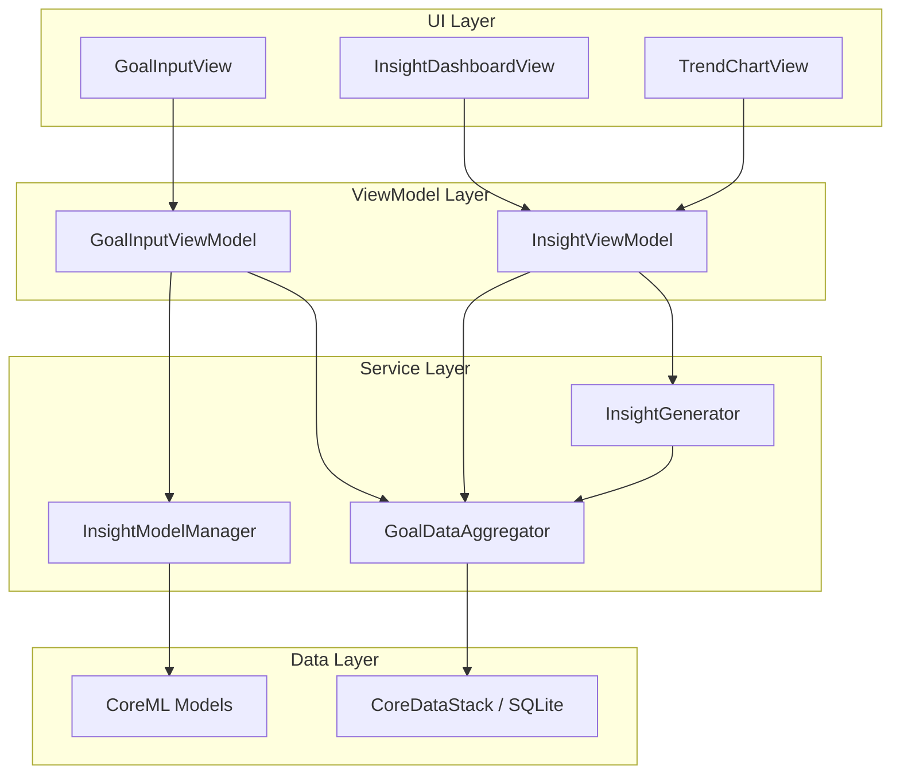

### 9.2 InsightModelManager 扩展

```swift
import CoreML

class InsightModelManager {
    
    // MARK: - Properties
    
    /// 共享特征提取器（静态，只加载一次）
    private let featureExtractor: BertFeatureExtractor
    
    /// 所有分类器字典
    private var classifiers: [String: UpdatableClassifier] = [:]
    
    /// 分类器配置
    static let classifierConfigs: [ClassifierConfig] = [
        ClassifierConfig(name: "topic", numClasses: 16, isUpdatable: true),
        ClassifierConfig(name: "sentiment", numClasses: 3, isUpdatable: true),
        ClassifierConfig(name: "urgency", numClasses: 3, isUpdatable: true),
        ClassifierConfig(name: "timeFrame", numClasses: 4, isUpdatable: true),
        ClassifierConfig(name: "actionType", numClasses: 6, isUpdatable: true),
        ClassifierConfig(name: "difficulty", numClasses: 3, isUpdatable: true),
        ClassifierConfig(name: "specificity", numClasses: 3, isUpdatable: true),
    ]
    
    // MARK: - Initialization
    
    init() throws {
        // 加载特征提取器
        let feURL = Bundle.main.url(forResource: "BertFeatureExtractor", withExtension: "mlpackage")!
        self.featureExtractor = try BertFeatureExtractor(contentsOf: feURL)
        
        // 加载所有分类器
        for config in Self.classifierConfigs {
            let url = Self.getClassifierURL(name: config.name)
            classifiers[config.name] = try UpdatableClassifier(contentsOf: url, config: config)
        }
    }
    
    // MARK: - Inference
    
    /// 分析目标文本，返回所有维度的分类结果
    func analyze(text: String) -> GoalAnalysisResult {
        // 1. 分词
        let tokens = tokenize(text)
        
        // 2. 提取特征（只做一次）
        let embedding = try! featureExtractor.prediction(
            input_ids: tokens.inputIds,
            attention_mask: tokens.attentionMask
        ).embedding
        
        // 3. 并行调用所有分类器
        var results: [String: ClassificationResult] = [:]
        
        let group = DispatchGroup()
        let queue = DispatchQueue(label: "com.morninggoal.classifiers", attributes: .concurrent)
        let lock = NSLock()
        
        for (name, classifier) in classifiers {
            group.enter()
            queue.async {
                let result = try! classifier.predict(embedding: embedding)
                lock.lock()
                results[name] = result
                lock.unlock()
                group.leave()
            }
        }
        
        group.wait()
        
        return GoalAnalysisResult(
            text: text,
            embedding: embedding,
            classifications: results,
            timestamp: Date()
        )
    }
    
    // MARK: - Update
    
    /// 更新特定维度的分类器
    func update(
        dimension: String,
        embedding: MLMultiArray,
        correctLabel: Int
    ) async throws {
        guard let classifier = classifiers[dimension] else {
            throw InsightError.classifierNotFound(dimension)
        }
        
        try await classifier.update(embedding: embedding, label: correctLabel)
    }
    
    /// 批量更新
    func batchUpdate(
        dimension: String,
        trainingData: [(embedding: MLMultiArray, label: Int)]
    ) async throws {
        guard let classifier = classifiers[dimension] else {
            throw InsightError.classifierNotFound(dimension)
        }
        
        try await classifier.batchUpdate(data: trainingData)
    }
}
```

### 9.3 分类结果数据结构

```swift
struct GoalAnalysisResult: Codable {
    let text: String
    let embedding: [Float]  // 768维
    let classifications: [String: ClassificationResult]
    let timestamp: Date
    
    // 便捷访问器
    var topic: String { classifications["topic"]?.label ?? "unknown" }
    var sentiment: String { classifications["sentiment"]?.label ?? "neutral" }
    var urgency: String { classifications["urgency"]?.label ?? "medium" }
    var timeFrame: String { classifications["timeFrame"]?.label ?? "today" }
    var actionType: String { classifications["actionType"]?.label ?? "lifestyle" }
    var difficulty: String { classifications["difficulty"]?.label ?? "moderate" }
    var specificity: String { classifications["specificity"]?.label ?? "moderate" }
}

struct ClassificationResult: Codable {
    let label: String
    let confidence: Float
    let probabilities: [String: Float]
}
```

### 9.4 洞察展示 UI

```swift
struct InsightDashboardView: View {
    @ObservedObject var viewModel: InsightViewModel
    
    var body: some View {
        ScrollView {
            VStack(spacing: 16) {
                // 快速统计卡片
                QuickStatsCard(stats: viewModel.weeklyStats)
                
                // 洞察列表
                ForEach(viewModel.insights) { insight in
                    InsightCard(insight: insight)
                }
                
                // 趋势图表
                SentimentTrendChart(data: viewModel.sentimentTrend)
                
                // 目标分布饼图
                GoalDistributionChart(data: viewModel.actionTypeDistribution)
            }
            .padding()
        }
        .navigationTitle("我的洞察")
    }
}

struct InsightCard: View {
    let insight: Insight
    
    var body: some View {
        VStack(alignment: .leading, spacing: 8) {
            HStack {
                Image(systemName: insight.type.iconName)
                    .foregroundColor(insight.type.color)
                Text(insight.title)
                    .font(.headline)
                Spacer()
            }
            
            Text(insight.description)
                .font(.body)
                .foregroundColor(.secondary)
            
            if let suggestion = insight.actionSuggestion {
                Text("💡 \(suggestion)")
                    .font(.callout)
                    .foregroundColor(.blue)
            }
        }
        .padding()
        .background(Color(.systemBackground))
        .cornerRadius(12)
        .shadow(radius: 2)
    }
}
```

---

## 10. 训练与部署流程

### 10.1 数据准备

#### 10.1.1 标注数据生成

```python
# src/data/generate_insight_labels.py

import pandas as pd
import re
from typing import Dict, List

def generate_urgency_labels(texts: List[str]) -> List[int]:
    """基于规则生成紧急度标签"""
    labels = []
    high_keywords = ['今天', '立即', '马上', '紧急', '必须', 'deadline', '截止']
    medium_keywords = ['本周', '这周', '尽快', '近期', '这几天']
    
    for text in texts:
        if any(kw in text for kw in high_keywords):
            labels.append(2)  # high
        elif any(kw in text for kw in medium_keywords):
            labels.append(1)  # medium
        else:
            labels.append(0)  # low
    
    return labels

def generate_timeframe_labels(texts: List[str]) -> List[int]:
    """基于时间词提取时间范围"""
    labels = []
    patterns = {
        0: r'今天|今日|今晚|现在|马上',           # today
        1: r'本周|这周|这个星期|周末',             # this_week
        2: r'本月|这个月|月底',                    # this_month
        3: r'今年|长期|一直|持续|每天|每周'        # long_term
    }
    
    for text in texts:
        matched = False
        for label, pattern in patterns.items():
            if re.search(pattern, text):
                labels.append(label)
                matched = True
                break
        if not matched:
            labels.append(0)  # default: today
    
    return labels

def generate_specificity_labels(texts: List[str]) -> List[int]:
    """基于文本结构判断具体程度"""
    labels = []
    
    for text in texts:
        # 检查是否包含数字（量化指标）
        has_number = bool(re.search(r'\d+', text))
        # 检查文本长度
        word_count = len(text)
        # 检查是否有具体动作词
        has_action = any(word in text for word in ['完成', '读完', '跑步', '学习', '写'])
        
        if has_number and word_count > 10:
            labels.append(2)  # specific
        elif has_action or word_count > 6:
            labels.append(1)  # moderate
        else:
            labels.append(0)  # vague
    
    return labels
```

#### 10.1.2 使用 LLM 辅助标注

```python
# src/data/llm_labeling.py

import openai
from typing import List, Dict

def get_difficulty_labels_with_llm(texts: List[str], batch_size: int = 20) -> List[int]:
    """使用 LLM 辅助标注难度"""
    
    prompt_template = """
    请判断以下目标的难度等级。
    
    难度等级定义：
    - 0 (easy): 简单任务，耗时短，无技能门槛。如"买牛奶"、"回复邮件"
    - 1 (moderate): 中等任务，需要一定时间或努力。如"完成周报"、"跑步30分钟"  
    - 2 (hard): 困难任务，耗时长或有挑战性。如"完成论文初稿"、"学习新编程语言"
    
    请对每个目标输出难度等级数字（0/1/2），用逗号分隔。
    
    目标列表：
    {goals}
    
    输出格式：0,1,2,1,0,...
    """
    
    all_labels = []
    
    for i in range(0, len(texts), batch_size):
        batch = texts[i:i+batch_size]
        goals_str = '\n'.join([f"{j+1}. {goal}" for j, goal in enumerate(batch)])
        
        response = openai.ChatCompletion.create(
            model="gpt-4",
            messages=[
                {"role": "system", "content": "你是一个目标分析专家，帮助判断目标的难度等级。"},
                {"role": "user", "content": prompt_template.format(goals=goals_str)}
            ]
        )
        
        labels_str = response.choices[0].message.content.strip()
        batch_labels = [int(x.strip()) for x in labels_str.split(',')]
        all_labels.extend(batch_labels)
    
    return all_labels
```

### 10.2 训练新分类头

```python
# src/training/train_insight_classifiers.py

import torch
from torch.utils.data import DataLoader
from transformers import AdamW
from pathlib import Path
import json

class InsightClassifierTrainer:
    """训练洞察分类器"""
    
    def __init__(
        self,
        feature_extractor_path: str,
        output_dir: str,
        device: str = "mps"
    ):
        self.device = torch.device(device)
        self.output_dir = Path(output_dir)
        self.output_dir.mkdir(parents=True, exist_ok=True)
        
        # 加载特征提取器（冻结）
        self.feature_extractor = self.load_feature_extractor(feature_extractor_path)
        self.feature_extractor.eval()
        for param in self.feature_extractor.parameters():
            param.requires_grad = False
    
    def train_classifier(
        self,
        name: str,
        num_classes: int,
        train_embeddings: torch.Tensor,
        train_labels: torch.Tensor,
        val_embeddings: torch.Tensor = None,
        val_labels: torch.Tensor = None,
        epochs: int = 10,
        lr: float = 0.01,
        batch_size: int = 32
    ):
        """训练单个分类器"""
        
        print(f"\n{'='*60}")
        print(f"Training {name} Classifier ({num_classes} classes)")
        print(f"{'='*60}")
        
        # 创建简单的线性分类器
        classifier = torch.nn.Linear(768, num_classes).to(self.device)
        
        optimizer = torch.optim.SGD(classifier.parameters(), lr=lr, momentum=0.9)
        criterion = torch.nn.CrossEntropyLoss()
        
        # 创建 DataLoader
        train_dataset = torch.utils.data.TensorDataset(train_embeddings, train_labels)
        train_loader = DataLoader(train_dataset, batch_size=batch_size, shuffle=True)
        
        best_val_acc = 0
        
        for epoch in range(epochs):
            classifier.train()
            total_loss = 0
            
            for embeddings, labels in train_loader:
                embeddings = embeddings.to(self.device)
                labels = labels.to(self.device)
                
                optimizer.zero_grad()
                logits = classifier(embeddings)
                loss = criterion(logits, labels)
                loss.backward()
                optimizer.step()
                
                total_loss += loss.item()
            
            avg_loss = total_loss / len(train_loader)
            
            # 验证
            if val_embeddings is not None:
                val_acc = self.evaluate(classifier, val_embeddings, val_labels)
                print(f"Epoch {epoch+1}/{epochs} | Loss: {avg_loss:.4f} | Val Acc: {val_acc:.4f}")
                
                if val_acc > best_val_acc:
                    best_val_acc = val_acc
                    self.save_classifier(classifier, name, num_classes)
            else:
                print(f"Epoch {epoch+1}/{epochs} | Loss: {avg_loss:.4f}")
        
        # 保存最终模型
        self.save_classifier(classifier, name, num_classes)
        
        return classifier
    
    def save_classifier(self, classifier, name: str, num_classes: int):
        """保存分类器"""
        save_path = self.output_dir / f"{name}_classifier.pt"
        torch.save({
            'state_dict': classifier.state_dict(),
            'num_classes': num_classes,
            'hidden_size': 768
        }, save_path)
        print(f"Saved: {save_path}")
```

### 10.3 导出新分类器

```python
# src/export/export_insight_classifiers.py

from pathlib import Path
import torch
import coremltools as ct
from coremltools.models.neural_network import NeuralNetworkBuilder, SgdParams

def export_insight_classifier(
    classifier_path: str,
    output_dir: str,
    task_name: str,
    num_classes: int
):
    """导出单个洞察分类器为 CoreML 可更新模型"""
    
    output_dir = Path(output_dir)
    
    # 1. 加载 PyTorch 分类器
    checkpoint = torch.load(classifier_path)
    classifier = torch.nn.Linear(checkpoint['hidden_size'], checkpoint['num_classes'])
    classifier.load_state_dict(checkpoint['state_dict'])
    classifier.eval()
    
    # 2. Trace
    dummy_input = torch.randn(1, 768)
    traced = torch.jit.trace(classifier, dummy_input)
    
    # 3. 转换为 NeuralNetwork
    base_model = ct.convert(
        traced,
        inputs=[ct.TensorType(name="embedding", shape=(1, 768))],
        outputs=[ct.TensorType(name=f"{task_name}_logits")],
        minimum_deployment_target=ct.target.iOS14,
        convert_to="neuralnetwork"
    )
    
    # 4. 保存基础模型
    base_path = output_dir / f"{task_name.title()}Classifier_Base.mlmodel"
    base_model.save(str(base_path))
    
    # 5. 转换为可更新模型
    final_path = output_dir / f"{task_name.title()}Classifier_Updatable.mlpackage"
    make_updatable(base_path, final_path, task_name, num_classes)
    
    # 6. 清理
    base_path.unlink()
    
    print(f"✅ Exported: {final_path}")


def export_all_insight_classifiers(classifiers_dir: str, output_dir: str):
    """导出所有洞察分类器"""
    
    classifiers_config = [
        ("urgency", 3),
        ("timeFrame", 4),
        ("actionType", 6),
        ("difficulty", 3),
        ("specificity", 3),
    ]
    
    for task_name, num_classes in classifiers_config:
        classifier_path = Path(classifiers_dir) / f"{task_name}_classifier.pt"
        if classifier_path.exists():
            export_insight_classifier(
                str(classifier_path),
                output_dir,
                task_name,
                num_classes
            )
        else:
            print(f"⚠️ Skipping {task_name}: {classifier_path} not found")
```

### 10.4 完整部署流程

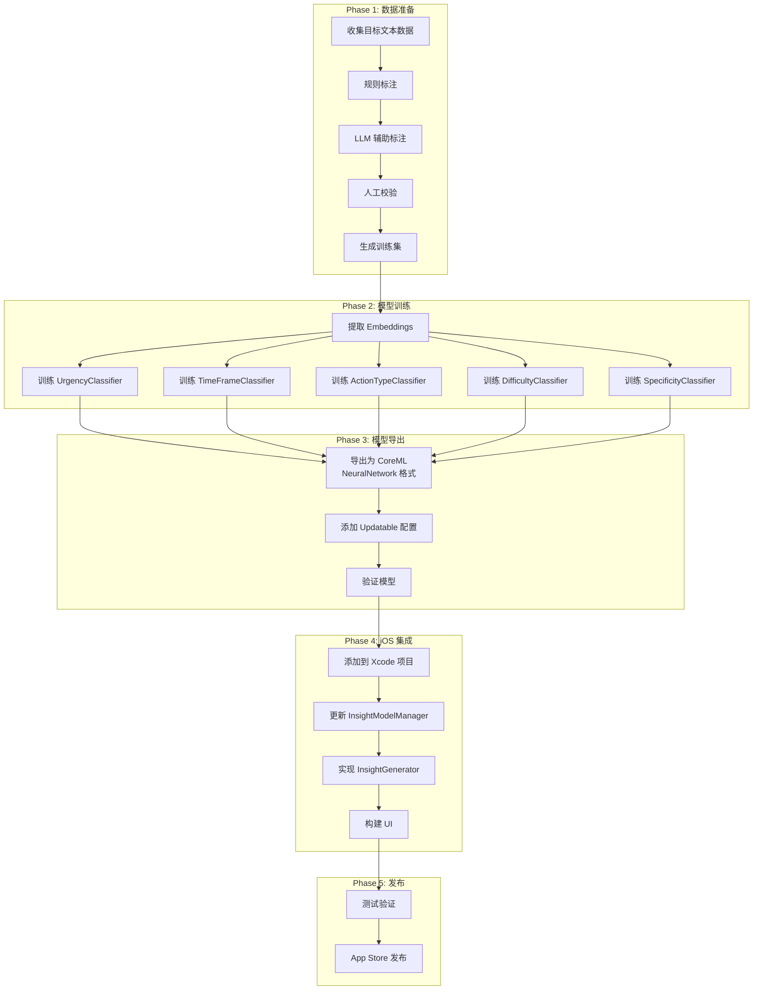

---

## 11. 实施路线图

### 11.1 阶段划分

| 阶段 | 内容 | 交付物 |
|-----|------|--------|
| **Phase 1** | 数据准备 & 标注 | 标注数据集 (5个新维度) |
| **Phase 2** | 训练新分类器 | 5个 PyTorch 分类器 |
| **Phase 3** | CoreML 导出 | 5个 .mlpackage 文件 |
| **Phase 4** | iOS 数据层 | Core Data 模型, 聚合服务 |
| **Phase 5** | 洞察引擎 | 规则引擎, 模板系统 |
| **Phase 6** | UI 开发 | 洞察仪表盘, 趋势图表 |
| **Phase 7** | 测试 & 优化 | 性能报告, 用户测试 |

### 11.2 技术里程碑

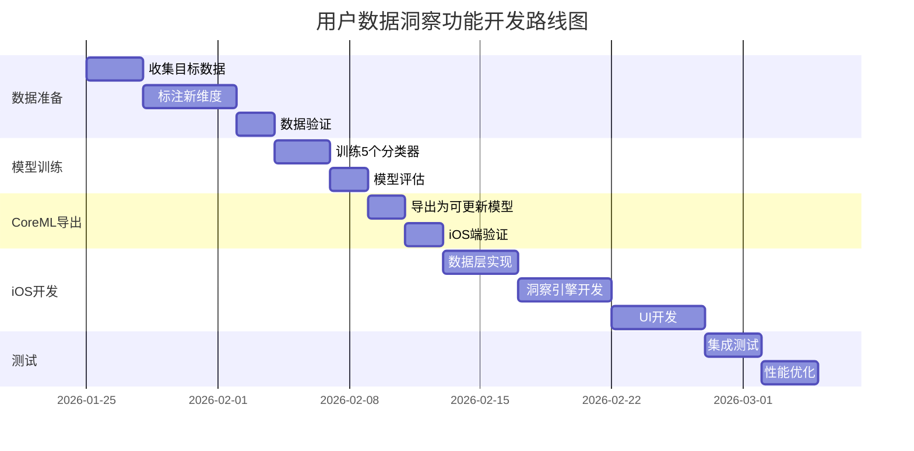

### 11.3 关键指标

| 指标 | 目标值 |
|-----|-------|
| 推理延迟 (7个分类器) | < 50ms |
| 洞察生成延迟 | < 100ms |
| 模型总体积增量 | < 100KB |
| 新分类器准确率 | > 80% |
| 端侧更新收敛速度 | < 10 epochs |

---

## 附录

### A. 文件结构 (扩展后)

```
MorningGoalModel/
├── src/
│   ├── data/
│   │   ├── generate_insight_labels.py    [新增]
│   │   └── llm_labeling.py               [新增]
│   ├── training/
│   │   └── train_insight_classifiers.py  [新增]
│   └── export/
│       └── export_insight_classifiers.py [新增]
├── models/
│   ├── trained/
│   │   └── insight_classifiers/          [新增]
│   └── exported_coreml/
│       ├── BertFeatureExtractor.mlpackage
│       ├── TopicClassifier_Updatable.mlpackage
│       ├── SentimentClassifier_Updatable.mlpackage
│       ├── UrgencyClassifier_Updatable.mlpackage     [新增]
│       ├── TimeFrameClassifier_Updatable.mlpackage   [新增]
│       ├── ActionTypeClassifier_Updatable.mlpackage  [新增]
│       ├── DifficultyClassifier_Updatable.mlpackage  [新增]
│       └── SpecificityClassifier_Updatable.mlpackage [新增]
└── docs/
    ├── updatable_model_analysis.md
    └── User_Insight_System_Design.md     [本文档]
```

### B. 参考资料

- [CoreML Updatable Models](https://developer.apple.com/documentation/coreml/making_a_model_updatable)
- [Core Data Best Practices](https://developer.apple.com/documentation/coredata)
- [SwiftUI Charts](https://developer.apple.com/documentation/charts)
