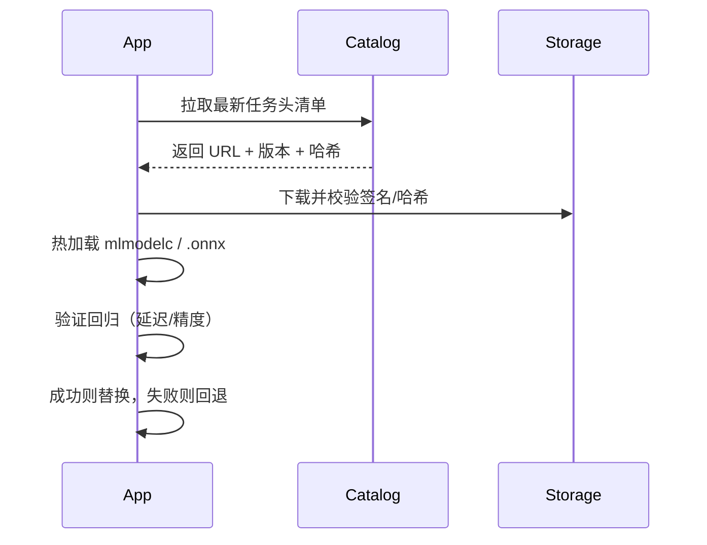

移动端架构：基座 + Updatable

目标
- 以“通用 Encoder 为基座 + 任务头可更新”为原则，降低发版频率与风险。

组件划分
- 基座：通用文本 Encoder（Core ML/ONNX），随 App 一起发布。
- 任务头：分类/序列标注等，按需更新，与基座保持版本兼容。
- 资源：Tokenizer 词表、配置与阈值，随任务头一起版本化。

更新流程


iOS 动态加载示例
```swift
let url = URL(fileURLWithPath: pathToDownloadedMLModelC)
let cfg = MLModelConfiguration()
cfg.computeUnits = .all
let model = try MLModel(contentsOf: url, configuration: cfg)
```

版本与兼容性
- 采用 `encoder@major.minor` 与 `head@major.minor`，维护兼容矩阵。
- 升级策略：先分阶段灰度任务头，观测指标后再升级基座。

Android 选型（参考）
- ONNX Runtime Mobile（小型化包体）、NCNN、MNN。统一接口：`input_ids/attention_mask/token_type_ids`。
- 量化：优先权重量化；静态量化需校准数据集，谨慎评估精度损失。

安全与隐私
- 包签名与哈希校验；崩溃/异常自动回退。
- 端侧仅保留必要日志与匿名指标；敏感数据不出端。