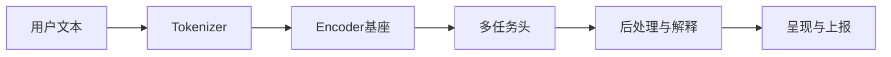

场景 01：如何将 BERT 应用于移动端文本洞察

目标
- 根据用户输入文本，在端侧完成分类与洞察生成（情感/意图/主题/风格）。

流程


步骤
- 1 数据定义：标签体系（情感/意图/主题），样本采集与清洗。
- 2 训练教师模型：`bert-base-chinese` 多任务头（共享 Encoder）。
- 3 蒸馏学生模型：TinyBERT/MobileBERT；量化与剪枝后回归评估。
- 4 导出与部署：Core ML/ONNX；固定序列长度与输入名称。
- 5 端侧实现：
  - Swift/Java 侧实现 Tokenizer 与 Padding。
  - 调用通用 Encoder + 多任务头；生成标签与置信度。
  - 解释型输出：Top-k 标签、置信区间、注意力热力（可选）。
- 6 监控与灰度：延迟/精度; 通过灰度更新任务头以持续迭代。

示例：端侧后处理（置信度与阈值）
```swift
func topK(_ logits: [Float], k: Int, threshold: Float) -> [(Int, Float)] {
    let softmax = logits.map { expf($0) }
    let sum = softmax.reduce(0, +)
    let probs = softmax.map { $0 / sum }
    let indexed = probs.enumerated().filter { $0.element >= threshold }
    return Array(indexed.sorted { $0.element > $1.element }.prefix(k))
}
```

成功标准
- 延迟 P50 < 30ms（seq_len=128）；精度降幅 ≤ 1% 相对教师；包体 ≤ 40MB。