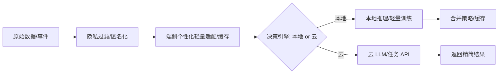

场景 02：端侧模型自训练与云 API 结合的设计

目标
- 2.1 端侧确保隐私数据仅在本地处理与学习。
- 2.2 性能要求高的场景结合云端大模型推理，同时兼顾隐私与效果。

总体架构


端侧个性化（轻量自训练）
- 不做全参数训练：采用 Adapter/LoRA 风格的轻量参数或阈值微调、用户画像缓存。
- 策略：
  - 规则与阈值学习：根据用户偏好自适应（例如置信阈、类别权重）。
  - 记忆缓存：历史输入 → 近似最近邻检索，避免重复调用云端。
  - 差分隐私与裁剪：对本地统计加噪，杜绝敏感信息外泄。

云端协同（高性能任务）
- 适用：长上下文/复杂生成/复杂检索。
- 机制：
  - 请求前匿名化与摘要化（移除用户标识/地点/设备信息）。
  - 仅上传必要特征或嵌入，禁止原文直传；必要时做局部脱敏。
  - 返回后在端侧做轻量后处理与融合。

决策引擎（本地/云选择）
```python
def route(task, metrics, privacy_level):
    if privacy_level == "strict":
        return "local"
    if metrics["latency_target"] < 20 and metrics["seq_len"] <= 128:
        return "local"
    if task in {"长文本生成", "复杂检索"}:
        return "cloud"
    return "local"
```

隐私与安全
- 本地存储：仅存匿名化特征与轻量参数；定期清理过期缓存。
- 传输：端到端加密；最小化上传内容；服务端零日志保留或短周期匿名日志。
- 合规：提供可撤回机制与透明化说明，开关由用户控制。

落地步骤
- 1 明确任务拆分：端侧适合的 vs 云端适合的。
- 2 端侧实现：轻量适配/缓存/阈值学习；评估延迟与精度。
- 3 云端实现：统一 API 网关与匿名化层；返回结构化结果。
- 4 决策引擎与监控：记录本地/云调用比例、失败与回退。
- 5 灰度与迭代：按指标阈值动态调整路由策略与模型版本。

成功标准
- 严格隐私场景 100% 端侧闭环；高性能场景云端调用满足延迟与质量；端侧与云端协同稳定。